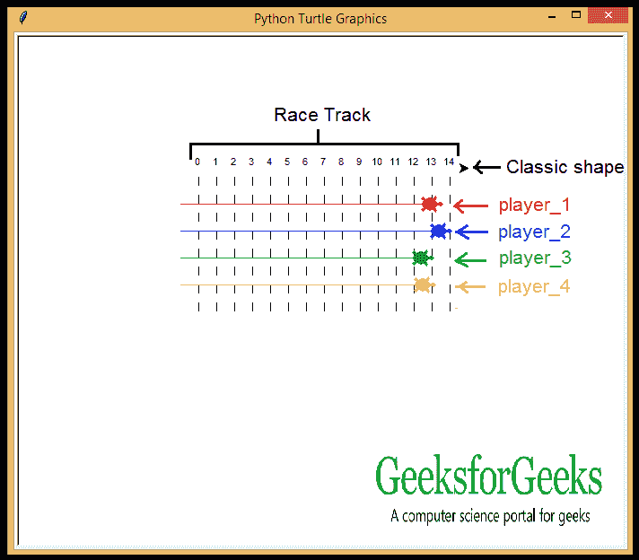

# 使用 Python 中的 Turtle 创建一个简单的动画

> 原文:[https://www . geesforgeks . org/create-a-simple-animation-use-turtle-in-python/](https://www.geeksforgeeks.org/create-a-simple-animation-using-turtle-in-python/)

**先决条件:**[Python 中的海龟编程](https://www.geeksforgeeks.org/turtle-programming-python/)

**乌龟**是画板一样的蟒蛇特征，让我们指挥一只乌龟在上面画来画去！我们可以使用像`turtle.forward(…)`和`turtle.right(…)`这样的可以移动乌龟的功能。让我们创建一个基本的动画，不同的小乌龟绕着为它们创建的赛道比赛。

### 要求

*   海龟模块
*   随机模块

### 方法

*   首先，导入所需的模块。
*   海龟模块中有不同形状的指针(如箭头、经典和海龟)。由于这是一场“海龟赛跑”，我们需要“海龟”和“经典”的造型。
*   我们将使用经典的形状来绘制赛道。
*   列出第一只乌龟的规格，让乌龟进入赛道，让乌龟为比赛做好准备。
*   对其余的海龟也这样做。
*   使用`randint()`设置乌龟的速度。

下面是实现。

```
# required modules
from turtle import * from random import randint

# classic shape turtle
speed(0)
penup()
goto(-140, 140)

# racing track

for step in range(15):
    write(step, align ='center')
    right(90)

    for num in range(8):
        penup()
        forward(10)
        pendown()
        forward(10)

    penup()
    backward(160)
    left(90)
    forward(20)

# first player details
player_1 = Turtle()
player_1.color('red')
player_1.shape('turtle')

# first player proceeds to racing track
player_1.penup()
player_1.goto(-160, 100)
player_1.pendown()

# 360 degree turn
for turn in range(10):
    player_1.right(36)

# second player details
player_2 = Turtle()
player_2.color('blue')
player_2.shape('turtle')

# second player enters in the racing track
player_2.penup()
player_2.goto(-160, 70)
player_2.pendown()

# 360 degree turn
for turn in range(72):
    player_2.left(5)

# third player details
player_3 = Turtle()
player_3.shape('turtle')
player_3.color('green')

# third player enters in the racing track
player_3.penup()
player_3.goto(-160, 40)
player_3.pendown()

# 360 degree turn
for turn in range(60):
    player_3.right(6)

# fourth player details
player_4 = Turtle()
player_4.shape('turtle')
player_4.color('orange')

# fourth player enters in the racing track
player_4.penup()
player_4.goto(-160, 10)
player_4.pendown()

# 360 degree turn
for turn in range(30):
    player_4.left(12)

# turtles run at random speeds
for turn in range(100):
    player_1.forward(randint(1, 5))
    player_2.forward(randint(1, 5))
    player_3.forward(randint(1, 5))
    player_4.forward(randint(1, 5))
```

**输出:**

