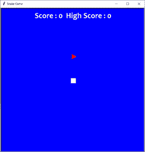
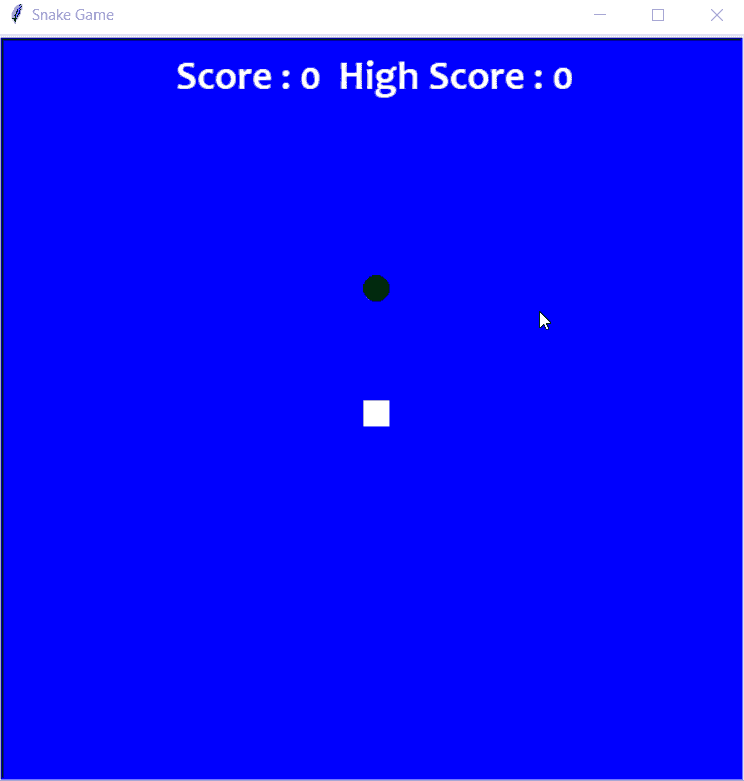

# 使用 Python 中的海龟创建一个蛇游戏

> 原文:[https://www . geesforgeks . org/create-a-snake-game-using-turtle-in-python/](https://www.geeksforgeeks.org/create-a-snake-game-using-turtle-in-python/)

一款蛇游戏是由 Gremlin Industries 开发，世嘉于 1976 年 10 月发布的**街机迷宫游戏**。它被认为是一种技巧性的游戏，已经在人们中间普及了几代人。蛇游戏中的蛇是通过四个方向按钮来控制的。玩家在游戏中的目标是通过收集食物或水果来获得尽可能多的积分。一旦蛇撞墙或撞到自己，玩家就输了。

对于 python 初学者来说，那些对让你的领域变得更容易感兴趣的人肯定可以尝试一下，而模块 **Turtle** 正是为了这个目的而制作的，供初学者尝试，也可以作为项目的一部分提交。这个程序将在 **Python 3** 中完成。

因此，我们将使用以下模块创建一个基于 Python 的游戏**:**

*   **Turtle:** 它是一个预装的 python 库，通过为用户提供一个虚拟画布，用户可以创建形状和图片。
*   **时间:**该功能用于统计自历元以来经过的秒数。
*   **随机数:**该功能是使用*随机数*模块在 Python 中生成随机数。

### 支持

使用专门为 Python 程序设计的 **PyCharm** 应用程序，可以轻松完成以下代码。

**同样，VSCode** 也可以用于这个程序。从 VSCode 的扩展安装 Python3。然后，以 **your_filename.py** 的形式保存程序

### 以下是使用海龟模块创建蛇游戏的分步方法:

**第一步**:我们将把模块导入到程序中，并给出游戏的默认值。

## 蟒蛇 3

```
import turtle
import time
import random

delay = 0.1
score = 0
high_score = 0
```

**第二步**:现在，我们将创建游戏的显示，即游戏的窗口屏幕，我们将在游戏中创建蛇的头部和蛇的食物，并在游戏的头部显示分数。

## 蟒蛇 3

```
# Creating a window screen
wn = turtle.Screen()
wn.title("Snake Game")
wn.bgcolor("blue")

# the width and height can be put as user's choice
wn.setup(width=600, height=600)
wn.tracer(0)

# head of the snake
head = turtle.Turtle()
head.shape("square")
head.color("white")
head.penup()
head.goto(0, 0)
head.direction = "Stop"

# food in the game
food = turtle.Turtle()
colors = random.choice(['red', 'green', 'black'])
shapes = random.choice(['square', 'triangle', 'circle'])
food.speed(0)
food.shape(shapes)
food.color(colors)
food.penup()
food.goto(0, 100)

pen = turtle.Turtle()
pen.speed(0)
pen.shape("square")
pen.color("white")
pen.penup()
pen.hideturtle()
pen.goto(0, 250)
pen.write("Score : 0  High Score : 0", align="center",
          font=("candara", 24, "bold"))
```

**输出:**



初始分数为表头，白色:蛇头，红色:水果

**第三步**:现在，我们将验证蛇的动作的关键。通过点击通常用于游戏的关键词“w”、“a”、“s”和“d”，我们可以在屏幕上操作蛇的动作。

## 蟒蛇 3

```
# assigning key directions
def group():
    if head.direction != "down":
        head.direction = "up"

def godown():
    if head.direction != "up":
        head.direction = "down"

def goleft():
    if head.direction != "right":
        head.direction = "left"

def goright():
    if head.direction != "left":
        head.direction = "right"

def move():
    if head.direction == "up":
        y = head.ycor()
        head.sety(y+20)
    if head.direction == "down":
        y = head.ycor()
        head.sety(y-20)
    if head.direction == "left":
        x = head.xcor()
        head.setx(x-20)
    if head.direction == "right":
        x = head.xcor()
        head.setx(x+20)

wn.listen()
wn.onkeypress(group, "w")
wn.onkeypress(godown, "s")
wn.onkeypress(goleft, "a")
wn.onkeypress(goright, "d")
```

**第 4 步**:现在，最后，我们将创建游戏，其中将发生以下情况:

*   当蛇吃水果时，它会长身体。
*   给蛇的尾巴上色。
*   水果吃完后，计分。
*   检查蛇头是否与身体或纱窗的墙壁碰撞。
*   碰撞后从一开始就自动重启游戏。
*   每次重新启动窗口时，都会引入水果的新形状和颜色。
*   分数将返回到零，高分将被保留，直到窗口没有关闭。

## 蟒蛇 3

```
segments = []

# Main Gameplay
while True:
    wn.update()
    if head.xcor() > 290 or head.xcor() < -290 or head.ycor() > 290 or head.ycor() < -290:
        time.sleep(1)
        head.goto(0, 0)
        head.direction = "Stop"
        colors = random.choice(['red', 'blue', 'green'])
        shapes = random.choice(['square', 'circle'])
        for segment in segments:
            segment.goto(1000, 1000)
        segments.clear()
        score = 0
        delay = 0.1
        pen.clear()
        pen.write("Score : {} High Score : {} ".format(
            score, high_score), align="center", font=("candara", 24, "bold"))
    if head.distance(food) < 20:
        x = random.randint(-270, 270)
        y = random.randint(-270, 270)
        food.goto(x, y)

        # Adding segment
        new_segment = turtle.Turtle()
        new_segment.speed(0)
        new_segment.shape("square")
        new_segment.color("orange")  # tail colour
        new_segment.penup()
        segments.append(new_segment)
        delay -= 0.001
        score += 10
        if score > high_score:
            high_score = score
        pen.clear()
        pen.write("Score : {} High Score : {} ".format(
            score, high_score), align="center", font=("candara", 24, "bold"))
    # Checking for head collisions with body segments
    for index in range(len(segments)-1, 0, -1):
        x = segments[index-1].xcor()
        y = segments[index-1].ycor()
        segments[index].goto(x, y)
    if len(segments) > 0:
        x = head.xcor()
        y = head.ycor()
        segments[0].goto(x, y)
    move()
    for segment in segments:
        if segment.distance(head) < 20:
            time.sleep(1)
            head.goto(0, 0)
            head.direction = "stop"
            colors = random.choice(['red', 'blue', 'green'])
            shapes = random.choice(['square', 'circle'])
            for segment in segments:
                segment.goto(1000, 1000)
            segment.clear()

            score = 0
            delay = 0.1
            pen.clear()
            pen.write("Score : {} High Score : {} ".format(
                score, high_score), align="center", font=("candara", 24, "bold"))
    time.sleep(delay)

wn.mainloop()
```

**下面根据上述方法完成程序:**

## 蟒蛇 3

```
# import required modules
import turtle
import time
import random

delay = 0.1
score = 0
high_score = 0

# Creating a window screen
wn = turtle.Screen()
wn.title("Snake Game")
wn.bgcolor("blue")
# the width and height can be put as user's choice
wn.setup(width=600, height=600)
wn.tracer(0)

# head of the snake
head = turtle.Turtle()
head.shape("square")
head.color("white")
head.penup()
head.goto(0, 0)
head.direction = "Stop"

# food in the game
food = turtle.Turtle()
colors = random.choice(['red', 'green', 'black'])
shapes = random.choice(['square', 'triangle', 'circle'])
food.speed(0)
food.shape(shapes)
food.color(colors)
food.penup()
food.goto(0, 100)

pen = turtle.Turtle()
pen.speed(0)
pen.shape("square")
pen.color("white")
pen.penup()
pen.hideturtle()
pen.goto(0, 250)
pen.write("Score : 0  High Score : 0", align="center",
          font=("candara", 24, "bold"))

# assigning key directions
def group():
    if head.direction != "down":
        head.direction = "up"

def godown():
    if head.direction != "up":
        head.direction = "down"

def goleft():
    if head.direction != "right":
        head.direction = "left"

def goright():
    if head.direction != "left":
        head.direction = "right"

def move():
    if head.direction == "up":
        y = head.ycor()
        head.sety(y+20)
    if head.direction == "down":
        y = head.ycor()
        head.sety(y-20)
    if head.direction == "left":
        x = head.xcor()
        head.setx(x-20)
    if head.direction == "right":
        x = head.xcor()
        head.setx(x+20)

wn.listen()
wn.onkeypress(group, "w")
wn.onkeypress(godown, "s")
wn.onkeypress(goleft, "a")
wn.onkeypress(goright, "d")

segments = []

# Main Gameplay
while True:
    wn.update()
    if head.xcor() > 290 or head.xcor() < -290 or head.ycor() > 290 or head.ycor() < -290:
        time.sleep(1)
        head.goto(0, 0)
        head.direction = "Stop"
        colors = random.choice(['red', 'blue', 'green'])
        shapes = random.choice(['square', 'circle'])
        for segment in segments:
            segment.goto(1000, 1000)
        segments.clear()
        score = 0
        delay = 0.1
        pen.clear()
        pen.write("Score : {} High Score : {} ".format(
            score, high_score), align="center", font=("candara", 24, "bold"))
    if head.distance(food) < 20:
        x = random.randint(-270, 270)
        y = random.randint(-270, 270)
        food.goto(x, y)

        # Adding segment
        new_segment = turtle.Turtle()
        new_segment.speed(0)
        new_segment.shape("square")
        new_segment.color("orange")  # tail colour
        new_segment.penup()
        segments.append(new_segment)
        delay -= 0.001
        score += 10
        if score > high_score:
            high_score = score
        pen.clear()
        pen.write("Score : {} High Score : {} ".format(
            score, high_score), align="center", font=("candara", 24, "bold"))
    # Checking for head collisions with body segments
    for index in range(len(segments)-1, 0, -1):
        x = segments[index-1].xcor()
        y = segments[index-1].ycor()
        segments[index].goto(x, y)
    if len(segments) > 0:
        x = head.xcor()
        y = head.ycor()
        segments[0].goto(x, y)
    move()
    for segment in segments:
        if segment.distance(head) < 20:
            time.sleep(1)
            head.goto(0, 0)
            head.direction = "stop"
            colors = random.choice(['red', 'blue', 'green'])
            shapes = random.choice(['square', 'circle'])
            for segment in segments:
                segment.goto(1000, 1000)
            segment.clear()

            score = 0
            delay = 0.1
            pen.clear()
            pen.write("Score : {} High Score : {} ".format(
                score, high_score), align="center", font=("candara", 24, "bold"))
    time.sleep(delay)

wn.mainloop()
```



演示最终的游戏，显示所有用代码编写的内容