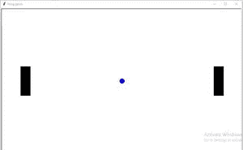

# 使用 Python-Turtle 创建乒乓游戏

> 原文:[https://www . geesforgeks . org/create-pong-game-use-python-turtle/](https://www.geeksforgeeks.org/create-pong-game-using-python-turtle/)

乒乓是最著名的街机游戏之一，模拟乒乓球。每个玩家通过在屏幕的左侧或右侧垂直拖动来控制游戏中的桨。运动员用球拍在球上来回击球。

海龟是 Python 中内置的图形模块。它使用面板和笔来描绘插图。

**以下是使用的步骤:**

*   **步骤 1)** 在屏幕的左右两侧创建两个拨片 A 和 B。
*   **步骤 2)** 创建一个球。
*   **步骤 3)** 创建一个事件，按下某个键时垂直移动桨。
*   **第 4 步)**创建在每个玩家错过碰撞后更新分数的功能。

**下面是创建桨和球的程序:**

## 蟒蛇 3

```py
# Import required library
import turtle

# Create screen
sc = turtle.Screen()
sc.title("Pong game")
sc.bgcolor("white")
sc.setup(width=1000, height=600)

# Left paddle
left_pad = turtle.Turtle()
left_pad.speed(0)
left_pad.shape("square")
left_pad.color("black")
left_pad.shapesize(stretch_wid=6, stretch_len=2)
left_pad.penup()
left_pad.goto(-400, 0)

# Right paddle
right_pad = turtle.Turtle()
right_pad.speed(0)
right_pad.shape("square")
right_pad.color("black")
right_pad.shapesize(stretch_wid=6, stretch_len=2)
right_pad.penup()
right_pad.goto(400, 0)

# Ball of circle shape
hit_ball = turtle.Turtle()
hit_ball.speed(40)
hit_ball.shape("circle")
hit_ball.color("blue")
hit_ball.penup()
hit_ball.goto(0, 0)
hit_ball.dx = 5
hit_ball.dy = -5
```

输出:



**下面是使用海龟库创建乒乓游戏的完整 python 程序。**

## 计算机编程语言

```py
# Import required library
import turtle

# Create screen
sc = turtle.Screen()
sc.title("Pong game")
sc.bgcolor("white")
sc.setup(width=1000, height=600)

# Left paddle
left_pad = turtle.Turtle()
left_pad.speed(0)
left_pad.shape("square")
left_pad.color("black")
left_pad.shapesize(stretch_wid=6, stretch_len=2)
left_pad.penup()
left_pad.goto(-400, 0)

# Right paddle
right_pad = turtle.Turtle()
right_pad.speed(0)
right_pad.shape("square")
right_pad.color("black")
right_pad.shapesize(stretch_wid=6, stretch_len=2)
right_pad.penup()
right_pad.goto(400, 0)

# Ball of circle shape
hit_ball = turtle.Turtle()
hit_ball.speed(40)
hit_ball.shape("circle")
hit_ball.color("blue")
hit_ball.penup()
hit_ball.goto(0, 0)
hit_ball.dx = 5
hit_ball.dy = -5

# Initialize the score
left_player = 0
right_player = 0

# Displays the score
sketch = turtle.Turtle()
sketch.speed(0)
sketch.color("blue")
sketch.penup()
sketch.hideturtle()
sketch.goto(0, 260)
sketch.write("Left_player : 0    Right_player: 0",
             align="center", font=("Courier", 24, "normal"))

# Functions to move paddle vertically
def paddleaup():
    y = left_pad.ycor()
    y += 20
    left_pad.sety(y)

def paddleadown():
    y = left_pad.ycor()
    y -= 20
    left_pad.sety(y)

def paddlebup():
    y = right_pad.ycor()
    y += 20
    right_pad.sety(y)

def paddlebdown():
    y = right_pad.ycor()
    y -= 20
    right_pad.sety(y)

# Keyboard bindings
sc.listen()
sc.onkeypress(paddleaup, "e")
sc.onkeypress(paddleadown, "x")
sc.onkeypress(paddlebup, "Up")
sc.onkeypress(paddlebdown, "Down")

while True:
    sc.update()

    hit_ball.setx(hit_ball.xcor()+hit_ball.dx)
    hit_ball.sety(hit_ball.ycor()+hit_ball.dy)

    # Checking borders
    if hit_ball.ycor() > 280:
        hit_ball.sety(280)
        hit_ball.dy *= -1

    if hit_ball.ycor() < -280:
        hit_ball.sety(-280)
        hit_ball.dy *= -1

    if hit_ball.xcor() > 500:
        hit_ball.goto(0, 0)
        hit_ball.dy *= -1
        left_player += 1
        sketch.clear()
        sketch.write("Left_player : {}    Right_player: {}".format(
                      left_player, right_player), align="center",
                      font=("Courier", 24, "normal"))

    if hit_ball.xcor() < -500:
        hit_ball.goto(0, 0)
        hit_ball.dy *= -1
        right_player += 1
        sketch.clear()
        sketch.write("Left_player : {}    Right_player: {}".format(
                                 left_player, right_player), align="center",
                                 font=("Courier", 24, "normal"))

    # Paddle ball collision
    if (hit_ball.xcor() > 360 and
                        hit_ball.xcor() < 370) and
                        (hit_ball.ycor() < right_pad.ycor()+40 and
                        hit_ball.ycor() > right_pad.ycor()-40):
        hit_ball.setx(360)
        hit_ball.dx*=-1

    if (hit_ball.xcor()<-360 and
                       hit_ball.xcor()>-370) and
                       (hit_ball.ycor()<left_pad.ycor()+40 and
                        hit_ball.ycor()>left_pad.ycor()-40):
        hit_ball.setx(-360)
        hit_ball.dx*=-1
```

**输出:**

<video class="wp-video-shortcode" id="video-482299-1" width="640" height="360" preload="metadata" controls=""><source type="video/mp4" src="https://media.geeksforgeeks.org/wp-content/uploads/20200905203316/2020-09-05-20-31-05.mp4?_=1">[https://media.geeksforgeeks.org/wp-content/uploads/20200905203316/2020-09-05-20-31-05.mp4](https://media.geeksforgeeks.org/wp-content/uploads/20200905203316/2020-09-05-20-31-05.mp4)</video>