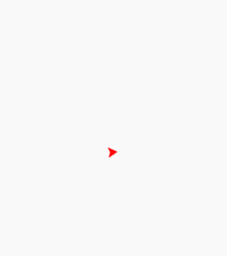

# 用 Python 中的乌龟绘制彩色立体立方体

> 原文:[https://www . geesforgeks . org/draw-color-solid-cube-using-turtle-in-python/](https://www.geeksforgeeks.org/draw-colored-solid-cube-using-turtle-in-python/)

海龟是 Python 中的一个内置模块。它规定:

1.  使用屏幕(纸板)绘图。
2.  乌龟(钢笔)。

要在屏幕上画东西，我们需要移动这只乌龟(笔)，而要移动这只乌龟(笔)，有一些功能，比如前进()，后退()，等等。

**先决条件:** [海龟编程基础知识](https://www.geeksforgeeks.org/turtle-programming-python/)

### 绘制彩色立体立方体

在这一节中，我们将讨论如何绘制一个立体立方体。

**进场:**

> 1.  Import turtle
> 2.  Set the window screen
> 3.  Set the color of turtle.
> 4.  Form a face of a cube.
> 5.  Fill color
> 6.  Repeat steps 3, 4 and 5 for the other two faces.

**代码:**

## 蟒蛇 3

```
# Draw color-filled solid cube in turtle

# Import turtle package
import turtle

# Creating turtle pen
pen = turtle.Turtle()

# Size of the box
x = 120

# Drawing the right side of the cube
def right():
    pen.left(45)
    pen.forward(x)
    pen.right(135)
    pen.forward(x)
    pen.right(45)
    pen.forward(x)
    pen.right(135)
    pen.forward(x)

# Drawing the left side of the cube
def left():
    pen.left(45)
    pen.forward(x)
    pen.left(135)
    pen.forward(x)
    pen.left(45)
    pen.forward(x)
    pen.left(135)
    pen.forward(x)

# Drawing the top side of the cube
def top():
    pen.left(45)
    pen.forward(x)
    pen.right(90)
    pen.forward(x)
    pen.right(90)
    pen.forward(x)
    pen.right(90)
    pen.forward(x)
    pen.right(135)
    pen.forward(x)

# Set the fill color to 
# red for the right side
pen.color("red")

# Start filling the color
pen.begin_fill()
right()

# Ending the filling of the color
pen.end_fill()

# Set the fill color to 
# blue for the left side
pen.color("blue")

# Start filling the color
pen.begin_fill()
left()

# Ending the filling of the color
pen.end_fill()

# Set the fill color to 
#green for the top side
pen.color("green")

# Start filling the color
pen.begin_fill()
top()

# Ending the filling of the color
pen.end_fill()
```

**输出:**

