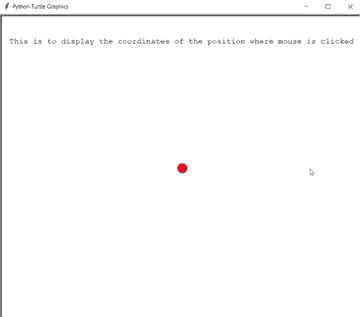

# 用龟

在鼠标点击的各个位置画线

> 原文:[https://www . geeksforgeeks . org/在相应位置画线-用鼠标点击-海龟/](https://www.geeksforgeeks.org/draw-lines-at-the-respective-positions-clicked-by-the-mouse-using-turtle/)

在本文中，我们将学习如何使用海龟模块在鼠标点击的任何位置画线。

**乌龟图形:**

*   **turtle.listen():** 使用这个，我们可以进行键盘输入
*   **turtle.onscreenclick(func，1 或 3):** 该函数用于将趣味绑定到画布上的鼠标点击事件。1 表示左键单击，3 表示右键单击。
*   **pen.goto(x 坐标，y 坐标):**沿着两个位置之间的最短线性路径(即当前位置和(x，y)之间的直线)将海龟从当前位置移动到 x，y 位置
*   **pen.color(颜色):**这个方法是用来改变乌龟的颜色的
*   **笔形(形状):**这个方法是用来给乌龟赋予形状的
*   **head . penip:**拿起笔，这样乌龟在移动时就不会画线了
*   **head.hideturtle:** 这个方法是用来让乌龟隐形的。这是一个好主意，当你在一个复杂的绘图过程中时，因为隐藏海龟会显著加快绘图速度。这个方法不需要任何参数。
*   **head.clear:** 此功能用于从屏幕上删除海龟的图纸
*   **head.write:** 此功能用于在当前龟位写文字。

**进场:**

*   导入海龟模块。
*   为海龟笔和海龟头定义两个实例。
*   头部是告诉当前点击哪个捐赠鼠标。
*   给实例赋予形状和颜色
*   定义函数 btnclick，它接受两个参数 x 和 y 坐标，现在在这个函数中使用函数 goto()将海龟带到参数中传递的 x 和 y 坐标。
*   使用 onscreenclick 在屏幕上用鼠标单击来绑定 b 单击功能。
*   使用函数监听执行上述指定的任务。

**下面是上述方法的 Python 实现:**

## 蟒蛇 3

```py
# python program
# import for turtle module
import turtle

# defining instance of turtle
pen=turtle.Turtle()
head=turtle.Turtle()
head.penup()
head.hideturtle()
head.goto(0, 260)
head.write("This is to display the coordinates of the position where mouse is clicked",
           align = "center", 
           font = ("courier", 12, "normal"))

# giving circle shape to pen i.e. instance of turtle
pen.shape("circle")

# giving colour to turtle
pen.color("red")

# define function to make the turtle move 
# to the position which is clicked by the mouse
def btnclick(x, y):
    pen.goto(x, y)
    head.clear()    
    head.write(f"x coordinate = {x}, y coordinate = {y}",
               align = "center", font = ("courier", 24, "normal"))

# this function will call btnclick whenever mouse is clicked    
turtle.onscreenclick(btnclick, 1)
turtle.listen()
```

**输出:**

