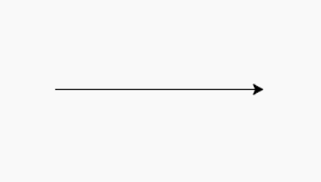
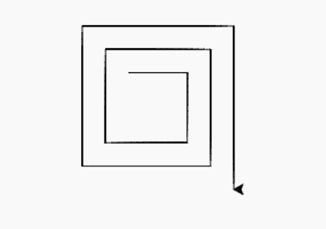

# Python–turtle . delay()方法

> 原文:[https://www.geeksforgeeks.org/python-turtle-delay-method/](https://www.geeksforgeeks.org/python-turtle-delay-method/)

**海龟图**是一种向孩子介绍编程的流行方式。它是沃利·福尔泽格、西蒙·派珀特和辛西娅·所罗门于 1967 年开发的原始 Logo 编程语言的一部分。

海龟模块以面向对象和面向过程的方式提供海龟图形原语。因为它使用 tkinter 作为底层图形，所以需要安装一个支持 Tk 的 Python 版本。

## turtle.delay()

此方法用于返回或设置绘图延迟(以毫秒为单位)。它只需要一个可选参数作为延迟的正整数。

> **语法:**龟. delay(延迟)
> T3】参数:
> 
> *   **延迟:**正整数，表示延迟时间(毫秒)，是可选的
> 
> **返回:**延迟值

以下是上述方法的实现，并附有一些示例:
**示例 1 :**

```
# import package
import turtle

# turtle movement with
# normal speed
turtle.forward(100)

# slow the speed by 
# turtle delay
turtle.delay(50)

# turtle movement
turtle.forward(80)
```

**输出:**


**例 2 :**

```
# import package
import turtle 

# loop for pattern
for i in range(10):

    # set turtle delay
    turtle.delay(10 * i)

    # motion for pattern
    turtle.forward(50 + 10 * i)
    turtle.right(90)
```

**输出:**
