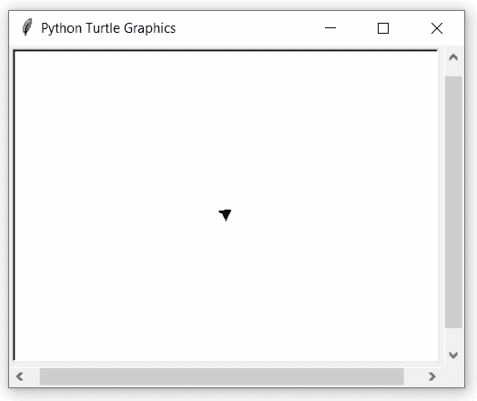

# 蟒蛇–龟.弧度()

> 原文:[https://www.geeksforgeeks.org/python-turtle-radians/](https://www.geeksforgeeks.org/python-turtle-radians/)

海龟模块以面向对象和面向过程的方式提供海龟图形原语。因为它使用 Tkinter 作为底层图形，所以它需要安装一个支持 Tk 的 Python 版本。

## turtle .弧度()

此方法用于将角度测量单位设置为弧度。这不需要任何争论。默认情况下，角度测量单位是“度”。

> **语法:**龟.弧度()
> T3】参数:无
> T6】返回:无

下面是上述方法的实现，并附有一些例子:

**例 1 :**

## 蟒蛇 3

```
# importing package
import turtle

# move as default in degrees
turtle.left(90)

# take value by heading
print(turtle.heading())

# set to radians
turtle.radians()

# again take value by heading
print(turtle.heading())
```

**输出:**

```
90.0
1.5707963267948966
```

**例 2 :**

## 蟒蛇 3

```
# importing package
import turtle

# set to radians
turtle.radians()

# turn to left by 90
turtle.left(90)

# move forward by 100
turtle.forward(100)
```

**输出:**



如果度量单位是度，那么它的形状向左旋转 90 度，向前旋转 100 度。但是在将测量单位设置为弧度后，可以清楚地看到它移动到 90 弧度= 5156.62 度(14 x 360 + 116.62)，比向前移动了 100 个单位。