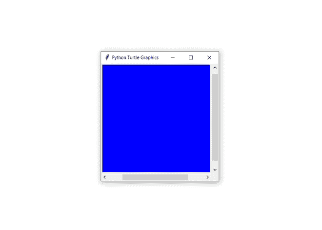
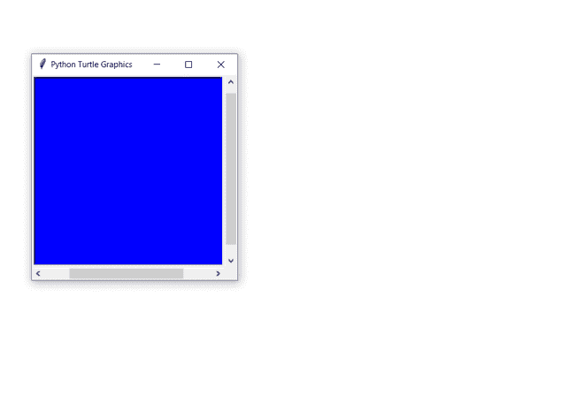

# 蟒蛇——乌龟。屏幕()。设置()方法

> 原文:[https://www . geesforgeks . org/python-海龟-屏幕-设置-方法/](https://www.geeksforgeeks.org/python-turtle-screen-setup-method/)

[海龟](https://www.geeksforgeeks.org/turtle-programming-python/)模块以面向对象和面向过程的方式提供海龟图形原语。因为它使用 [tkinter](https://www.geeksforgeeks.org/python-gui-tkinter/) 作为底层图形，所以它需要一个安装了 Tk 支持的 Python 版本。

## 乌龟。屏幕()。设置()方法:

此方法用于设置主窗口的大小和位置。

> **语法:**龟。屏幕()。设置(宽度=0.5，高度=0.75，startx =无，starty =无)
> 
> **参数:**该方法有以下参数:
> 
> *   **宽度:**以像素为单位的整数大小，作为屏幕的一部分浮动。默认为屏幕的 50%。
> *   **高度:**为整数以像素为单位的高度，作为屏幕的一部分浮动。默认为屏幕的 75%。
> *   **startx:** 如果为正，则从屏幕左边缘开始以像素为单位的起始位置，如果为负，则从右边缘开始。默认情况下，startx =无将窗口水平居中。
> *   **starty:** 如果为正，则从屏幕上边缘开始以像素为单位的起始位置，如果为负，则从下边缘开始。默认情况下，starty =无将窗口垂直居中。

下面是上述方法的实现，并附有一些例子:

**示例 1:** 更改窗口的配置。

## 蟒蛇 3

```py
# import turtle package
import turtle

# making turtle object
sc = turtle.Screen()

# setup the screen size
sc.setup(400,400)

# set the background color
sc.bgcolor("blue")

# This code is contributed
# by Deepanshu Rustagi.
```

**输出:**



**示例 2:** 通过在 setup()方法中设置‘startx’和‘starty’来更改窗口的位置。

## 蟒蛇 3

```py
# import turtle package
import turtle

# making turtle object
sc = turtle.Screen()

# set the screen size 400x400 pixels
# set the screen position by
# startx to 50
# starty to-200
sc.setup(400, 400, startx = 50,
         starty = -200)

# set the background color
sc.bgcolor("blue")

# This code is contributed 
# by Deepanshu Rustagi.
```

**输出:**

