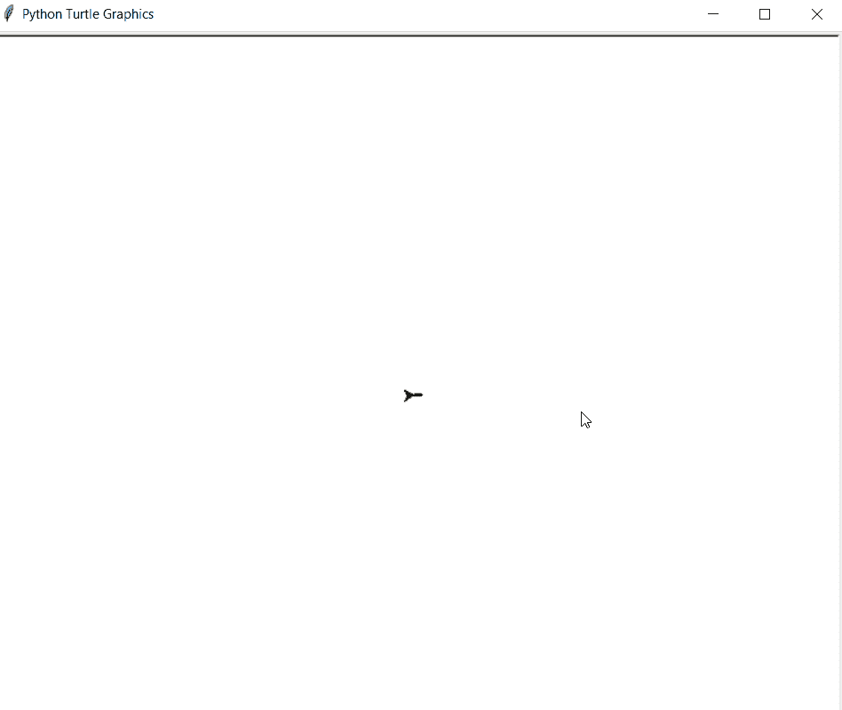

# Python–使用海龟图形

书写“GFG”

> 原文:[https://www . geesforgeks . org/python-write-gfg-using-turtle-graphics/](https://www.geeksforgeeks.org/python-write-gfg-using-turtle-graphics/)

在本文中，我们将学习如何使用 Python 中的海龟图形来编写**“GFG”**。首先让我们知道什么是海龟图形。

> ### 海龟图形
> 
> *   **Backward (length):** Move the pen backward by x units.
> *   **Right (angle):** Turn the pen clockwise by an angle X. 。
> *   **Left (angle):** Turn the pen counterclockwise by an angle X. 。
> *   **penip ():** Stop drawing turtle pens.
> *   **Peng Duoen ():** Start drawing turtle pens.

## 方法

*   导入海龟模块。

    ```
    import turtle
    ```

*   获取一个屏幕进行绘制

    ```
    ws=turtle.Screen()
    ```

*   为**龟定义一个实例。**
*   为了打印 **G** 我们必须做一个半圆，然后通过旋转乌龟并向前移动来完成它。
*   然后对于 **F** 使用 **penup()向上移动笔，**然后 **goto()** 到想要的坐标，然后使用 **pendown()** 向下笔进行绘制，绘制 F
*   对于剩余的 **G** 转到其他坐标，按照第一个 **G** 所做的相同操作。

**下面是上述方法的 python 实现:**

## 蟒蛇 3

```
#python program for printing "GFG"
#importing turtle modules
import turtle

#setting up workscreen
ws=turtle.Screen()

#defining turtle instance
t=turtle.Turtle()

#turtle pen will be of "GREEN" color
t.color("Green")

#setting width of pen
t.width(3)

#for printing letter "G"
for x in range(180):
    t.backward(1)
    t.left(1)
t.right(90)
t.forward(50)
t.right(90)
t.forward(30)
t.right(90)
t.forward(50)

#for printing letter "F"
t.penup()
t.goto(40,0)
t.pendown()
t.forward(110)
t.goto(40,0)
t.left(90)
t.forward(50)
t.penup()
t.goto(40,-50)
t.pendown()
t.forward(40)

#for printing letter "G"
t.penup()
t.goto(150,0)
t.pendown()
for x in range(180):
    t.backward(1)
    t.left(1)
t.right(90)
t.forward(50)
t.right(90)
t.forward(30)
t.right(90)
t.forward(50)
```

### 输出:

