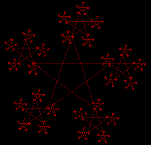

# 使用 Python 中的 Turtle 进行星形分形打印

> 原文:[https://www . geeksforgeeks . org/star-fractal-printing-using-海龟-in-python/](https://www.geeksforgeeks.org/star-fractal-printing-using-turtle-in-python/)

**先决条件:** [海龟编程基础知识](https://www.geeksforgeeks.org/turtle-programming-python/)

分形是具有重复有限次的自相似结构的物体。本文的目的是绘制一个星形分形，在星形的每个角上绘制一个星形结构，重复这个过程，直到输入大小减少到 **10** 的值。为了实现这种星形分形图案，使用了**龟**模块。

### **使用的方法**

*   **向前(值):**向前移动乌龟。
*   **速度(值):**改变乌龟的速度。
*   **penip():**停止绘图。
*   **pendown():** 开始绘图。
*   **向左(数值):**向左移动乌龟。

### **接近**

1.  进口海龟。
2.  初始化海龟。
3.  更改背景颜色。
4.  做一个画星星的函数。
5.  在 for 循环中递归调用上面的函数，生成整个开始模式。

下面是上述方法的实现。

## 蟒蛇 3

```py
# import turtle
import turtle

# initialise turtle instance
stars = turtle.Turtle()

# increases the speed of turtle
stars.speed(10)

# to change the background color
stars.getscreen().bgcolor("black")
stars.color("red")

# stop drawing
stars.penup()

# move the turtle
stars.goto((-200, 50))

# start drawing
stars.pendown()

# function to draw stars
def star(turtle, size):
    if size <= 10:
        return
    else:
        for i in range(5):

            # moving turtle forward
            turtle.forward(size)
            star(turtle, size/3)

            # moving turtle left
            turtle.left(216)

# calling the star function
star(stars, 360)
turtle.done()
```

**输出:**

