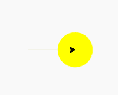
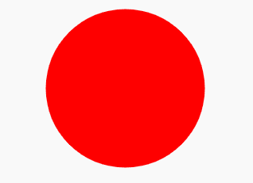

# Python 中的 turtle.dot()函数

> 原文:[https://www . geesforgeks . org/turtle-dot-function-in-python/](https://www.geeksforgeeks.org/turtle-dot-function-in-python/)

海龟模块以面向对象和面向过程的方式提供海龟图形原语。因为它使用 Tkinter 作为底层图形，所以它需要安装一个支持 Tk 的 Python 版本。

## turtle.dot()

这个函数用来画一个特定大小的圆形点，带有一些颜色。如果未给出尺寸，则使用 pension ze+4 和 2 * pensize 的最大值。

**语法:**

```py
turtle.dot(size=None, *color)

```

**参数:**

<figure class="table">

| **论据** | **描述** |
| 大小 | > = 1 的整数(如果给定) |
| 颜色 | 颜色字符串或数字颜色元组 |

</figure>

下面是上述方法的实现，并附有一些例子:

**例 1 :**

## 蟒蛇 3

```py
# import package
import turtle

# motion
turtle.forward(100)

# dot with
# 60 diameter
# yellow color
turtle.dot(60, color="yellow")
```

**输出:**



**例 2 :**

## 蟒蛇 3

```py
# import package
import turtle

# delay the turtle work speed
# for better understandings
turtle.delay(500)

# hide the turtle
turtle.ht()

# some dots with diameter and color
turtle.dot(200, color="red")
turtle.dot(180, color="orange")
turtle.dot(160, color="yellow")
turtle.dot(140, color="green")
turtle.dot(120, color="blue")
turtle.dot(100, color="indigo")
turtle.dot(80, color="violet")
turtle.dot(60, color="white")

# write text
turtle.write("GFG", align="center",
             font=('Verdana', 12, 'bold'))
```

**输出:**

