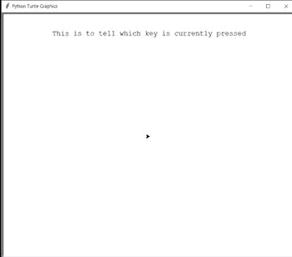

# 乌龟–使用箭头键

画线

> 原文:[https://www . geesforgeks . org/海龟-画线-使用箭头键/](https://www.geeksforgeeks.org/turtle-draw-lines-using-arrow-keys/)

在本文中，我们将学习如何在海龟图形中使用键盘(箭头键)绘制线条。让我们首先讨论在下面的实现中使用的一些方法:

1.  **wn.listen():** 使用这个，我们可以进行键盘输入
2.  **wn.onkeypress(func，“key”):**此函数用于将 fun 绑定到按键的按键释放事件。为了能够注册按键事件，TurtleScreen 必须有焦点。
3.  **setx(位置):**此方法用于将海龟的第二个坐标设置为 x，保持第一个坐标不变在这里，无论海龟的位置是什么，它都会将 x 坐标设置为给定的输入，保持 y 坐标不变。
4.  **sety(位置):**此方法用于将海龟的第二个坐标设置为 y，保持第一个坐标不变在这里，无论海龟的位置是什么，它都会将 y 坐标设置为给定的输入，保持 x 坐标不变。
5.  **ycor():** 此功能用于返回海龟当前位置的海龟 y 坐标。这不需要任何争论。
6.  **xcor():** 此功能用于返回海龟当前位置的海龟 x 坐标。这不需要任何争论
7.  **head . penip:**拿起笔，这样乌龟在移动时就不会画线了
8.  **head.hideturtle:** 这个方法是用来让乌龟隐形的。这是一个好主意，当你在一个复杂的绘图过程中时，因为隐藏海龟会显著加快绘图速度。这个方法不需要任何参数。
9.  **head.clear:** 此功能用于从屏幕上删除海龟的图纸
10.  **head.write:** 此功能用于在当前龟位处书写文字。

**接近**

*   导入海龟模块。
*   找个屏幕来画画
*   给乌龟定义两个例子，一个是笔，另一个是头。
*   Head 表示当前按下了哪个键
*   定义乌龟上下左右移动的功能。
*   在相应的向上、向左、向右和向下功能中，设置箭头，通过改变 x 和 y 坐标分别向上、向左、向右和向下移动 100 个单位。
*   使用函数 listen()进行键盘输入。
*   使用 onkeypress 注册按键事件。

**下面是上述方法的 Python 实现:**

## 蟒蛇 3

```
# import for turtle module
import turtle

# making a workScreen
wn = turtle.Screen()

# defining 2 turtle instance
head = turtle.Turtle()
pen = turtle.Turtle()

# head is for telling which key is pressed
head.penup()
head.hideturtle()

# head is at 0,260 coordinate
head.goto(0, 260)
head.write("This is to tell which key is currently pressed",
           align="center", font=("courier", 14, "normal"))

def f():
    y = pen.ycor()
    pen.sety(y+100)
    head.clear()
    head.write("UP", align="center", font=("courier", 24, "normal"))

def b():
    y = pen.ycor()
    pen.sety(y-100)
    head.clear()
    head.write("Down", align="center", font=("courier", 24, "normal"))

def l():
    x = pen.xcor()
    pen.setx(x-100)
    head.clear()
    head.write("left", align="center", font=("courier", 24, "normal"))

def r():
    x = pen.xcor()
    pen.setx(x+100)
    head.clear()
    head.write("Right", align="center", font=("courier", 24, "normal"))

wn.listen()
wn.onkeypress(f, "Up")  # when up is pressed pen will go up
wn.onkeypress(b, "Down")  # when down is pressed pen will go down
wn.onkeypress(l, "Left")  # when left is pressed pen will go left
wn.onkeypress(r, "Right")  # when right is pressed pen will go right
```

**输出**

