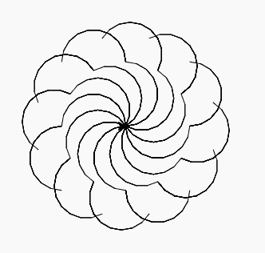

# Python 中的 turtle.home()函数

> 原文:[https://www . geesforgeks . org/海龟之家-python 中的函数/](https://www.geeksforgeeks.org/turtle-home-function-in-python/)

海龟模块以面向对象和面向过程的方式提供海龟图形原语。因为它使用 Tkinter 作为底层图形，所以它需要安装一个支持 Tk 的 Python 版本。

## turtle.home()

该函数用于将海龟移动到原点，即坐标(0，0)。不管乌龟的位置是什么，它都设置为(0，0)默认方向(朝东)。

**语法:**

```
turtle.home()

```

下面是上述方法的实现，并附有一些例子:

**例 1 :**

## 蟒蛇 3

```
# import package
import turtle

# check turtle position
print(turtle.position())

# motion
turtle.forward(100)

# check turtle position
print(turtle.position())

# set turtle to home
turtle.home()

# check turtle position
print(turtle.position())

# motion
turtle.right(90)
turtle.forward(100)

# check turtle position
print(turtle.position())

# set turtle to home
turtle.home()

# check turtle position
print(turtle.position())
```

**输出:**

```
(0.0, 0.0)
(100.0, 0.0)
(0.0, 0.0)
(0.0, -100.0)
(0.0, 0.0)

```

**例 2 :**

## 蟒蛇 3

```
# import package
import turtle

# set turtle speed to fastest
# for bettrt understandings
turtle.speed(10)

# method to draw a part
def fxn():

  # motion
  turtle.circle(50,180)
  turtle.right(90)
  turtle.circle(50,180)

# loop to draw pattern
for i in range(12):
  fxn()

  # set turtle at home
  turtle.up()
  turtle.home()
  turtle.down()

  # set position
  turtle.left(30*(i+1))
```

**输出:**

