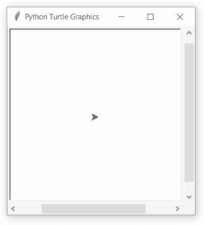

# Python 中的 turtle.onclick()函数

> 原文:[https://www . geesforgeks . org/turtle-onclick-function-in-python/](https://www.geeksforgeeks.org/turtle-onclick-function-in-python/)

海龟模块以面向对象和面向过程的方式提供海龟图形原语。因为它使用 Tkinter 作为底层图形，所以它需要安装一个支持 Tk 的 Python 版本。

## turtle.onclick()

这个函数用于将乐趣绑定到这只海龟或画布上的鼠标点击事件。

**语法:**

```py
turtle.onclick(fun, btn=1, add=None)

```

**参数:**

<figure class="table">

| **论据** | **描述** |
| 乐趣 | 一个有两个参数的函数，画布上被点击的点的坐标将被分配给这个函数 |
| btn | 鼠标按钮的数量默认为 1(鼠标左键) |
| 增加 | 真或假。如果为真，将添加新绑定，否则，它将替换以前的绑定 |

</figure>

下面是上述方法的实现，并附有一些例子:

**例 1 :**

## 蟒蛇 3

```py
# import package
import turtle

# method to action
def fxn(x,y):

    # some motion
    turtle.right(90)
    turtle.forward(100)

# turtle speed to slowest
turtle.speed(1)

# motion
turtle.fd(100)

# allow user to click 
# for some action
turtle.onclick(fxn)
```

**输出:**



**例 2 :**

## 蟒蛇 3

```py
# import package
import turtle

# screen object
wn = turtle.Screen()

# method to perform action
def fxn(x, y):
  turtle.goto(x, y)
  turtle.write(str(x)+","+str(y))

# onclick action 
wn.onclick(fxn)
wn.mainloop()
```

**输出:**

