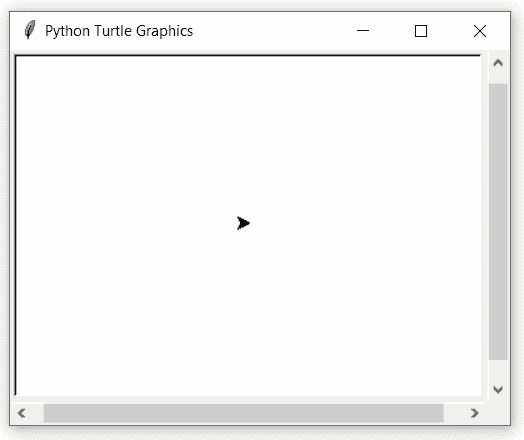

# Python 中的 turtle.settiltangle()函数

> 原文:[https://www . geesforgeks . org/turtle-settilt angle-function-in-python/](https://www.geeksforgeeks.org/turtle-settiltangle-function-in-python/)

海龟模块以面向对象和面向过程的方式提供海龟图形原语。因为它使用 Tkinter 作为底层图形，所以它需要安装一个支持 Tk 的 Python 版本。

## turtle.settiltangle（）

该功能用于旋转[高领衫](https://www.geeksforgeeks.org/turtle-shape-function-in-python/)指向角度指定的方向，无论其当前倾斜角度如何。它不会改变海龟的方向，也就是运动的方向。

> **语法:**龟背倾角(角度)
> 
> **参数:**
> 
> **角度:**此方法类似于 [turtle.tilt()](https://www.geeksforgeeks.org/turtle-tilt-function-in-python/) 方法(将海龟倾斜角度作为当前方向的输入)，但是 turtle.settiltangle()方法将倾斜角度设置为输入，而不采用当前方向。

下面是上述方法的实现，并附有一些例子:

**例 1 :**

## 蟒蛇 3

```py
# import package
import turtle

# set turtle position
turtle.up()
turtle.setpos(-100,0)
turtle.down()

# set turtle speed
turtle.speed(1)

# set tilt angle to 90
turtle.settiltangle(90)

# motion
turtle.forward(100)

# set tilt angle to 270 (not 90+270=360)
turtle.settiltangle(270)

# motion
turtle.forward(100)
```

**输出:**


#### **例 2 :**

## 蟒蛇 3

```py
# import package
import turtle

# set turtle
turtle.speed(1)
turtle.up()
turtle.setpos(-50,100)
turtle.down()
turtle.shape("turtle")
turtle.width(2)

# loop for pattern
for i in range(6):

    # motion
    turtle.forward(100)

    # set tilt angle by 180
    turtle.settiltangle(180)

    # print turtleshape
    turtle.stamp()

    # move to right by 60
    turtle.right(60)

# hide the turtle
turtle.ht()
```

**输出:**

