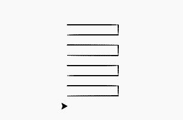

# Python 中的 turtle.sety()函数

> 原文:[https://www . geesforgeks . org/turtle-sety-function-in-python/](https://www.geeksforgeeks.org/turtle-sety-function-in-python/)

海龟模块以面向对象和面向过程的方式提供海龟图形原语。因为它使用 Tkinter 作为底层图形，所以它需要安装一个支持 Tk 的 Python 版本。

## turtle.sety()

此方法用于将海龟的第二个坐标设置为 y，保持第一个坐标不变。在这里，不管乌龟的位置是什么，它都将 y 坐标设置为给定的输入，保持 x 坐标不变。

> **语法:**乌龟. sety(y)
> 
> **参数:**
> 
> **y:** 一个数字(整数或浮点数)，它是唯一需要的参数。

下面是上述方法的实现，并附有一些例子:

**例 1 :**

## 蟒蛇 3

```py
# import package
import turtle

# check the turtle position
print(turtle.position())

# set the y coordinate
turtle.sety(30)

# check the turtle position
print(turtle.position())

# set the y coordinate
turtle.sety(-50)

# check the turtle position
print(turtle.position())
```

**输出:**

```py
(0.0, 0.0)
(0.0, 30.0)
(0.0, -50.0)
```

**例 2 :**

## 蟒蛇 3

```py
# import package
import turtle

# loop for pattern
for i in range(4):

  # motion
  turtle.forward(100)
  turtle.right(90)
  turtle.forward(20)
  turtle.right(90)
  turtle.forward(100)

  # set the y coordinate
  turtle.up()
  turtle.sety(-40*(i+1))
  turtle.down()

  # change the direction
  turtle.left(180)
```

**输出:**

