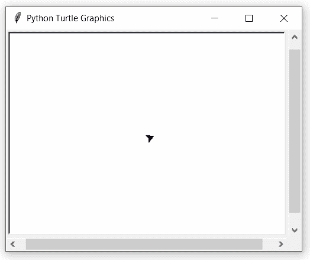

# Python 中的 turtle.shapetransform()函数

> 原文:[https://www . geesforgeks . org/turtle-shape transform-function-in-python/](https://www.geeksforgeeks.org/turtle-shapetransform-function-in-python/)

海龟模块以面向对象和面向过程的方式提供海龟图形原语。因为它使用 Tkinter 作为底层图形，所以它需要安装一个支持 Tk 的 Python 版本。

## turtle.shapetransform()

该函数用于设置或返回龟形的当前变换矩阵。如果没有给定矩阵元素，则返回变换矩阵。否则，设置给定的元素，并根据由第一行 t11、t12 和第二行 t21、22 组成的矩阵变换套头形状。

> **语法:**turtle . shape transform(t11 =无，t12 =无，t21 =无，t22 =无)
> 
> **参数:**
> 
> **t11、t12、t21、t22(可选):**行列式 t11 * t22–T12 * t21 不能为零，否则会产生错误。

下面是上述方法的实现，并附有一些例子:

**例 1 :**

## 蟒蛇 3

```
# import package
import turtle

# check the default value
print(turtle.shapetransform())
```

**输出:**

```
(1.0, 0.0, 0.0, 1.0)

```

**例 2 :**

## 蟒蛇 3

```
# import package
import turtle

# change shapetransform to 2,0,2,0
# as determinant of the matrix 
# [[2,0],[0,2]] is 0.
# so, raised an error 
turtle.shapetransform(2,0,2,0)
```

**输出:**

> 乌龟。TurtleGraphicsError:错误的形状转换矩阵:不能是单数

**例 3 :**

## 蟒蛇 3

```
# import package
import turtle

# loop for pattern
for i in range(5):
    for j in range(10):

        # motion
        turtle.forward(5+5*(i+j))
        turtle.left(45)

    # transform the shape 
    turtle.shapetransform(i+1,0,0,i+1)
```

**输出:**

