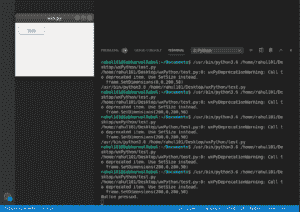

# wxPython–Python 中的

# 按钮

> 原文:[https://www.geeksforgeeks.org/button-in-wxpython-python/](https://www.geeksforgeeks.org/button-in-wxpython-python/)

在本文中，我们将学习如何在 wxPython 中向框架添加按钮。这可以通过使用 `wx.Button class`的`Button()`构造器来完成。

> 此类支持以下样式:
> 
> *   wx。BU_LEFT:左对齐标签。仅限 Windows 和 GTK+版本。
> *   wx。BU_TOP:将标签与按钮顶部对齐。仅限 Windows 和 GTK+版本。
> *   wx。右对齐位图标签。仅限 Windows 和 GTK+版本。
> *   wx。BU_BOTTOM:将标签与按钮底部对齐。仅限 Windows 和 GTK+版本。
> *   wx。BU_EXACTFIT:默认情况下，所有按钮都至少由标准按钮尺寸制成，即使它们的内容足够小，可以容纳更小的尺寸。这样做是为了保持一致性，因为大多数平台在本机对话框中使用相同大小的按钮，但是可以通过指定此标志来覆盖。如果给了它，按钮将被做得刚好足够容纳它的内容。请注意，在生活垃圾下，如果按钮有非空标签，即使使用这种样式，按钮仍将至少具有标准高度。
> *   wx。BU_NOTEXT:禁用按钮中文本标签的显示，即使它有一个或它的 id 是带有相关标签的标准库存 id 之一:如果不使用这种样式，一个只显示位图但使用标准 id 的按钮也会显示标签。
> *   wx。边框 _ 无:创建没有边框的按钮。这一做法目前正在城市垃圾、GTK2 和 OSX/可可实施。

> **语法:**
> 
> ```py
> wx.StaticText(self, parent, id=ID_ANY, label=””, 
>               pos=DefaultPosition, size=DefaultSize, 
>                  style=0, validator= DefaultVadator, 
>                             name=StaticTextNameStr)
> 
> ```
> 
> **参数:**
> 
> | 参数 | 输入类型 | 描述 |
> | --- | --- | --- |
> | 父母 | wx。窗户 | 父窗口。不应该是无。 |
> | 身份证明（identification） | wx.窗口标识 | 控件标识符。值-1 表示默认值。 |
> | 标签 | 线 | 标示文字。 |
> | 刷卡机 | wx。要点 | 窗口位置。 |
> | 大小 | wx。窗户 | 窗口大小。 |
> | 风格 | 长的 | 窗口样式。 |
> | 验证器 | wx。验证器 | 窗口验证器。 |
> | 名字 | 线 | 窗口名称。 |

**示例#1:**

```py
# import wxPython
def onButton(event):
    print( "Button pressed.")

app = wx.App()
frame = wx.Frame(None, -1, 'win.py')
frame.SetDimensions(200, 0, 200, 50)

panel = wx.Panel(frame, wx.ID_ANY)
button = wx.Button(panel, wx.ID_ANY, 'Test', (10, 10))
button.Bind(wx.EVT_BUTTON, onButton)

frame.Show()
app.MainLoop()
```

**输出:**
