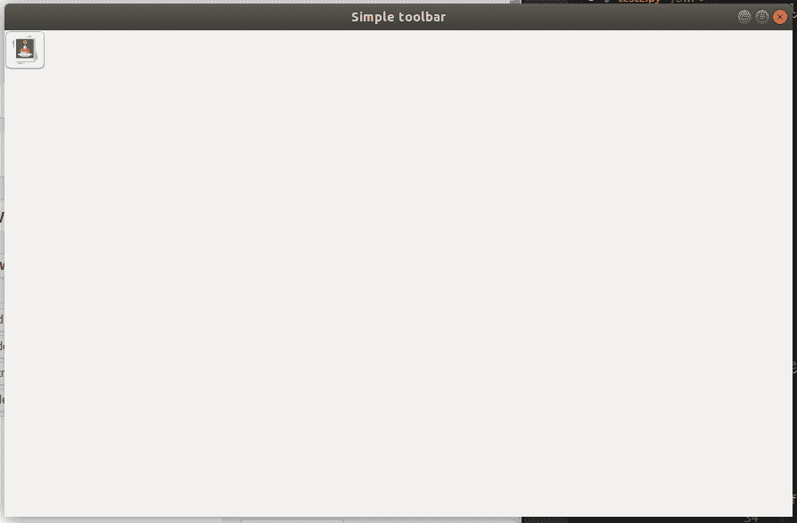

# python–wx python 中的 create toolbar()

> 原文:[https://www . geesforgeks . org/python-create toolbar-in-wxpython/](https://www.geeksforgeeks.org/python-createtoolbar-in-wxpython/)

在本文中，我们将学习如何在框架中添加工具栏。gui 应用程序中的工具栏提供了对各种重要工具的快速访问。我们可以使用 wx 中的 create toolbar()函数创建工具栏。wxPython 的框架类。

> **语法:** wx。框架。创建工具栏(自身，样式=TB_DEFAULT_STYLE，id=ID_ANY，名称= ToolBarNameStr)
> 
> **参数:**
> 
> | 参数 | 输入类型 | 描述 |
> | --- | --- | --- |
> | 风格 | 长的 | 工具栏样式。 |
> | 身份证明（identification） | （同 Internationalorganizations）国际组织 | 菜单项标识符。 |
> | 名字 | 线 | 工具栏窗口名称。 |
> 
> **如果工具栏创建成功，则返回:**工具栏指针，否则返回无。

**代码示例:**

```
import wx

class Example(wx.Frame):

    def __init__(self, *args, **kwargs):
        super(Example, self).__init__(*args, **kwargs)

        self.InitUI()

    def InitUI(self):

        # create toolbar using CreateToolBar function
        toolbar = self.CreateToolBar()
        qtool = toolbar.AddTool(wx.ID_ANY, 'Welcome', wx.Bitmap('/Desktop/wxPython/images.png'))
        toolbar.Realize()

        self.SetSize((600, 400))
        self.SetTitle('Simple toolbar')
        self.Centre()

    def OnQuit(self, e):
        self.Close()

def main():

    app = wx.App()
    ex = Example(None)
    ex.Show()
    app.MainLoop()

if __name__ == '__main__':
    main()
```

**输出:**
