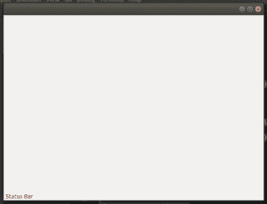

# Python–wxPython 中的 status bar

> 原文:[https://www.geeksforgeeks.org/python-statusbar-in-wxpython/](https://www.geeksforgeeks.org/python-statusbar-in-wxpython/)

在本文中，我们将学习如何向 wxPython 框架添加状态栏。我们可以使用 wx 中的 create status bar()函数在框架中创建状态栏。框架类。默认情况下，它具有白色背景和深灰色文本颜色。

> **语法:**
> 
> ```py
> wx.Frame.CreateStatusBar(self, number=1, style=STB_DEFAULT_STYLE,
>                                      id=0, name=StatusBarNameStr)
> 
> ```
> 
> **参数:**
> 
> | 参数 | 输入类型 | 描述 |
> | --- | --- | --- |
> | 父母 | wx。窗户 | 父窗口。不应该是无。 |
> | 数字 | （同 Internationalorganizations）国际组织 | 要创建的字段数量。指定大于 1 的值以创建多字段状态栏。 |
> | 风格 | 长的 | 状态栏样式。 |
> | 身份证明（identification） | wx.窗口标识 | 状态栏窗口标识符。如果为-1，wxWidgets 将选择一个标识符。 |
> | 名字 | 线 | 状态栏窗口名称。 |

**代码示例:**

```py
# import wxython
import wx

class Example(wx.Frame):

    def __init__(self, *args, **kw):
        super(Example, self).__init__(*args, **kw)
        self.InitUI()

    def InitUI(self):
        # create status bar
        self.statusBar = self.CreateStatusBar(style = wx.BORDER_NONE)
        # set text t status bar
        self.statusBar.SetStatusText("Status Bar")

def main():
    app = wx.App()
    ex = Example(None)
    ex.Show()
    app.MainLoop()

if __name__ == '__main__':
    main()  
```

**输出:**
