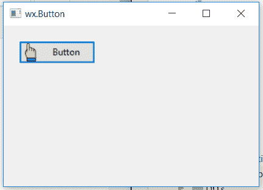

# wxPython–在按钮

中添加图像

> 原文:[https://www.geeksforgeeks.org/wxpython-add-image-in-button/](https://www.geeksforgeeks.org/wxpython-add-image-in-button/)

在本文中，我们将学习如何在按钮中添加图像。所以首先我们要创建一个 wx。位图对象，并用我们想要添加到按钮的图像初始化。之后我们将使用与 wx 相关联的 SetBitmap()函数。wxPython 的按钮类。

SetBitmap()函数取 wx。位图对象作为参数。

> **语法:** wx。Button.SetBitmap(自我、点阵图)
> 
> **参数:**
> 
> | 参数 | 输入类型 | 描述 |
> | --- | --- | --- |
> | 位图 | wx(地名)。点阵图(Bitmap) | 按钮的位图设置。 |

**代码示例:**

```py
import wx

class Example(wx.Frame):

    def __init__(self, *args, **kwargs):
        super(Example, self).__init__(*args, **kwargs)
        self.InitUI()

    def InitUI(self):
        self.locale = wx.Locale(wx.LANGUAGE_ENGLISH)

        # create parent panel for button
        self.pnl = wx.Panel(self)

        # create wx.Bitmap object 
        bmp = wx.Bitmap('pointer.png')

        # create button at point (20, 20)
        self.st = wx.Button(self.pnl, id = 1, label ="Button", pos =(20, 20),
                                        size =(100, 30),  name ="button")

        # set bmp as bitmap for button
        self.st.SetBitmap(bmp)

        self.SetSize((350, 250))
        self.SetTitle('wx.Button')
        self.Centre()

def main():
    app = wx.App()
    ex = Example(None)
    ex.Show()
    app.MainLoop()

if __name__ == '__main__':
    main()
```

**输出窗口:**
