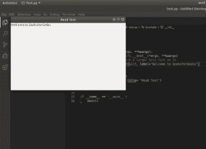
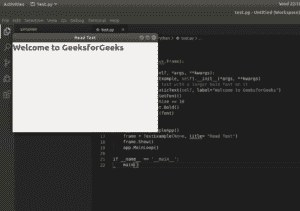

# wxPython–在窗口

中添加文本

> 原文:[https://www.geeksforgeeks.org/wxpython-add-text-in-window/](https://www.geeksforgeeks.org/wxpython-add-text-in-window/)

在本文中，我们将了解如何使用 wxPython 向窗口添加文本。这可以使用`wx.StaticText class`来完成。`StaticText()`构造函数控件显示一行或多行只读文本。

> **语法:**
> 
> ```
> wx.StaticText(self, parent, id=ID_ANY, label=””, pos=DefaultPosition,
>                     size=DefaultSize, style=0, name=StaticTextNameStr)
> 
> ```
> 
> **参数:**
> 
> | 参数 | 输入类型 | 描述 |
> | --- | --- | --- |
> | 父母 | wx。窗户 | 父窗口。不应该是无。 |
> | 身份证明（identification） | wx.窗口标识 | 控件标识符。值-1 表示默认值。 |
> | 标签 | 线 | 标示文字。 |
> | 刷卡机 | wx。要点 | 窗口位置。 |
> | 大小 | wx。窗户 | 窗口大小。 |
> | 风格 | 长的 | 窗口样式。 |
> | 名字 | 线 | 窗口名称。 |

**示例#1:**

```
# import wxPython
import wx

# create base class
class TextExample(wx.Frame):

    def __init__(self, *args, **kwargs):
        super(TextExample, self).__init__(*args, **kwargs)

        # lets put some text
        st = wx.StaticText(self, label ="Welcome to GeeksforGeeks")

def main():
    app = wx.PySimpleApp()
    frame = TextExample(None, title = "Read Text")
    frame.Show()
    app.MainLoop()

if __name__ == '__main__':
    main()
```

**输出:**


**例 2:**

```
# import wxPython
import wx

class TextExample(wx.Frame):

    def __init__(self, *args, **kwargs):
        super(TextExample, self).__init__(*args, **kwargs)
        # put some text
        st = wx.StaticText(self, label ="Welcome to GeeksforGeeks")

        # create font object
        font = st.GetFont()

        # increase text size
        font.PointSize += 10

        # make text bold
        font = font.Bold()

        # associate font with text
        st.SetFont(font)

def main():
    app = wx.PySimpleApp()

    frame = TextExample(None, title = "Read Text")
    frame.Show()
    app.MainLoop()

if __name__ == '__main__':
    main()
```

**输出:**
