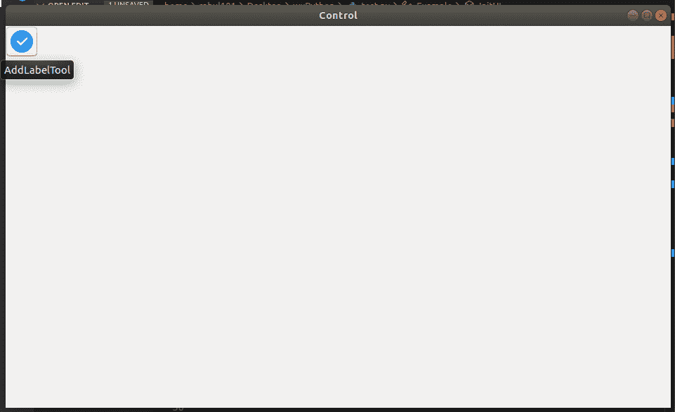

# wx Tyson–wx 中的 AddLabelTool()函数。工具栏

> 原文:[https://www . geesforgeks . org/wxpython-addlabeltool-function-in-wx-toolbar/](https://www.geeksforgeeks.org/wxpython-addlabeltool-function-in-wx-toolbar/)

在本文中，我们将学习 wx 中的另一种方法。wxPython 的 ToolBar 类，即 AddLabelTool()方法。AddLabelTool()是将工具添加到工具栏的旧样式方法。

> **语法:** wx。工具栏。AddLabelTool(self，id，标签，位图，bmpDisabled=wx。NullBitmap，kind=wx。ITEM_NORMAL，shortHelp= "，longHelp= "，clientData=None)
> 
> **参数:**
> 
> | 参数 | 输入类型 | 描述 |
> | --- | --- | --- |
> | 椅子 | （同 Internationalorganizations）国际组织 | 一个整数，通过它可以在后续操作中识别工具。 |
> | 标签 | 线 | 工具要显示的字符串。 |
> | 位图 | wx .位图 | 主要工具位图。 |
> | bmpDisabled | wx .位图 | 工具禁用时使用的位图。 |
> | 种类 | （同 Internationalorganizations）国际组织 | 有点像工具栏。 |
> | 简短的帮助 | 线 | 该字符串用于工具提示。 |
> | longHelp | 线 | 与工具关联的详细字符串。 |
> | clientdate | 普塞达塔 | 一个指向客户端数据的可选指针，稍后可以使用 GetToolClientData 检索该指针。 |

**代码示例:**

```
import wx

class Example(wx.Frame):
    global count
    count = 0;
    def __init__(self, *args, **kwargs):
        super(Example, self).__init__(*args, **kwargs)

        self.InitUI()

    def InitUI(self):
        pnl = wx.Panel(self)
        self.toolbar = self.CreateToolBar()

        # add tool using AddLabelTool() method
        qtool = self.toolbar.AddLabelTool(12, 'Quit',
                    wx.Bitmap('/Desktop/wxPython/right.png'), 
                                       kind = wx.ITEM_NORMAL,
                                   shortHelp ="AddLabelTool")

        self.toolbar.Realize()
        self.SetSize((350, 250))
        self.SetTitle('Control')
        self.Centre()

def main():

    app = wx.App()
    ex = Example(None)
    ex.Show()
    app.MainLoop()

if __name__ == '__main__':
    main()
```

**输出:**
