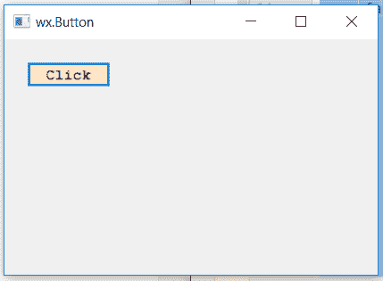

# wxPython–更改按钮的背景颜色

> 原文:[https://www . geesforgeks . org/wxpython-change-background-color-of-button/](https://www.geeksforgeeks.org/wxpython-change-background-colour-of-button/)

在本文中，我们将学习如何改变框架中按钮的背景颜色。我们使用 SetBackgroundColour()函数将按钮的背景颜色设置为不同的颜色。
需要一个 wx。作为参数的颜色类对象。

> **语法:** wx。按钮。设置背景颜色(自身，颜色)
> 
> **参数:**
> 
> | 参数 | 输入类型 | 描述 |
> | --- | --- | --- |
> | 颜色 | wx。颜色 | 背景颜色。 |

**代码示例:**

```py
import wx

class Example(wx.Frame):

    def __init__(self, *args, **kwargs):
        super(Example, self).__init__(*args, **kwargs)
        self.InitUI()

    def InitUI(self):
        self.locale = wx.Locale(wx.LANGUAGE_ENGLISH)
        self.pnl = wx.Panel(self)
        font = wx.Font(10, family = wx.FONTFAMILY_MODERN, style = 0, weight = 90,
                        underline = False, faceName ="", encoding = wx.FONTENCODING_DEFAULT)

        self.btn = wx.Button(self.pnl, id = 1, label ="Click", pos =(20, 20),
                                size = wx.DefaultSize, name ="statictext")
        self.btn.SetFont(font)

        # SET BACKGROUND COLOUR
        self.btn.SetBackgroundColour((255, 230, 200, 255))
        self.SetSize((350, 250))
        self.SetTitle('wx.Button')
        self.Centre()

def main():
    app = wx.App()
    ex = Example(None)
    ex.Show()
    app.MainLoop()

if __name__ == '__main__':
    main()
```

**输出寡妇:**
