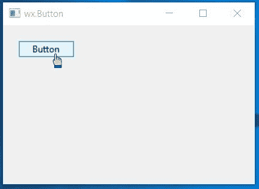

# wxPython–将光标悬停在按钮上进行更改

> 原文:[https://www . geesforgeks . org/wxpython-change-光标悬停在按钮上/](https://www.geeksforgeeks.org/wxpython-change-cursor-on-hover-on-button/)

在本文中，我们将学习当光标悬停在框架中的按钮上时，如何改变光标。我们需要遵循以下步骤。

> **步骤 1-** 创建一个 wx。带有要用作光标图像的图像的图像对象。
> **步骤 2-** 创建一个 wx。光标对象并传递 wx。上面创建的图像对象。
> **步骤 3-** 使用 SetCursor()功能设置光标。

> **语法:** wx。按钮。设置光标(光标)
> **参数:**
> 
> <figure class="table">
> 
> | 参数 | 输入类型 | 描述 |
> | --- | --- | --- |
> | 光标 | wx 游标 | 要设置的光标。 |
> 
> </figure>

**代码示例:**

## 蟒蛇 3

```
import wx

class Example(wx.Frame):

    def __init__(self, *args, **kwargs):
        super(Example, self).__init__(*args, **kwargs)
        self.InitUI()

    def InitUI(self):
        self.locale = wx.Locale(wx.LANGUAGE_ENGLISH)
        self.pnl = wx.Panel(self)

        # CREATE BUTTON AT POINT (20, 20)
        self.st = wx.Button(self.pnl, id = 1, label ="Button", pos =(20, 20),
                                size = wx.DefaultSize,  name ="button")
        # CREATE CURSOR OBJECT
        c = wx.Cursor(wx.Image('pointer.png'))
        # SET c AS CURSOR
        self.st.SetCursor(c)
        self.SetSize((350, 250))
        self.SetTitle('wx.Button')
        self.Centre()

def main():
    app = wx.App()
    ex = Example(None)
    ex.Show()
    app.MainLoop()

if __name__ == '__main__':
    main()
```

**输出窗口:**

