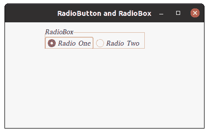

# wxPython–更改单选框

中文本的字体

> 原文:[https://www . geesforgeks . org/wxpython-change-font-for-text-present-in-radio-box/](https://www.geeksforgeeks.org/wxpython-change-font-for-text-present-in-radio-box/)

在这篇文章中，我们将学习如何改变收音机里的文本字体。为此，我们将遵循 3 个步骤:

> **步骤 1:** 创建一个 wx。名为
> 的字体对象变量**步骤 2:** 创建一个单选框。
> **第三步:**使用 SetFont()方法将 f 设置为单选框的字体。

> **语法:** wx。RadioBox.SetFont(自字体)
> 
> **参数**
> 
> | 参数 | 输入类型 | 描述 |
> | --- | --- | --- |
> | 字体 | wx(地名)。字体(t) | 用于无线电盒的字体 |

**代码示例:**

```py
import wx

class FrameUI(wx.Frame):

    def __init__(self, parent, title):
        super(FrameUI, self).__init__(parent, title = title, size =(300, 200))

        # function for in-frame components
        self.InitUI()

    def InitUI(self):
        # parent panel for radio box
        pnl = wx.Panel(self)

        # list of choices
        lblList = ['Radio One', 'Radio Two']

        # create wx.Font object
        fnt = wx.Font(10, family = wx.FONTFAMILY_DECORATIVE, style = wx.FONTSTYLE_ITALIC, 
                                                            weight = wx.FONTWEIGHT_LIGHT)

        # create radio box containing above list
        self.rbox = wx.RadioBox(pnl, label ='RadioBox', pos =(80, 10), choices = lblList,
                                         majorDimension = 1, style = wx.RA_SPECIFY_ROWS)

        # set fnt as font for text in radiobox
        self.rbox.SetFont(fnt)

        # set frame in centre
        self.Centre()
        # set size of frame
        self.SetSize((400, 250))
        # show output frame
        self.Show(True)

# wx App instance
ex = wx.App()
# Example instance
FrameUI(None, 'RadioButton and RadioBox')
ex.MainLoop()
```

**输出窗口:**
