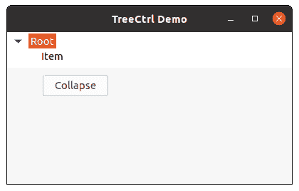
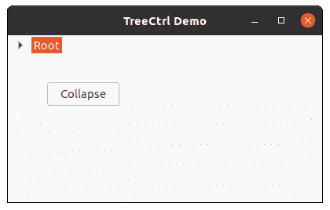

# wxPython–Collapse()方法 wx。TreeCtrl

> 原文:[https://www . geesforgeks . org/wxpython-collapse-method-wx-tree ctrl/](https://www.geeksforgeeks.org/wxpython-collapse-method-wx-treectrl/)

在本文中，我们将学习与 wx 相关联的 Collapse()方法。wxPython 的 TreeCtrl 类。Collapse()方法用于简单地折叠给定的项，即根项被折叠，子项不可见。
Collapse()方法取一个 wx。TreeItemId 参数。

> **语法:** wx。折叠(项目)
> 
> **参数**
> 
> | 参数 | 输入类型 | 描述 |
> | --- | --- | --- |
> | 项目 | wx(地名)。TreeItemId(树项目 Id) | 我们想要折叠的项目或根 |

**代码示例:**

```py
import wx

class MyTree(wx.TreeCtrl):

    def __init__(self, parent, id, pos, size, style):
        wx.TreeCtrl.__init__(self, parent, id, pos, size, style)

class TreePanel(wx.Panel):

    def __init__(self, parent):
        wx.Panel.__init__(self, parent)

        # create tree control
        self.tree = MyTree(self, wx.ID_ANY, wx.DefaultPosition, wx.DefaultSize,
                                                             wx.TR_HAS_BUTTONS)

        self.btn = wx.Button(self, 1, "Collapse", (50, 60))

        # add root to self.tree
        self.root = self.tree.AddRoot('Root')
        # add item to self.root
        item = self.tree.AppendItem(self.root, 'Item')

        # bind event with self.btn
        self.btn.Bind(wx.EVT_BUTTON, self.onclick)

        self.tree.Expand(self.root)

        sizer = wx.BoxSizer(wx.VERTICAL)
        sizer.Add(self.tree, 0, wx.EXPAND)
        self.SetSizer(sizer)

    def onclick(self, e):
        # collapse root
        self.tree.Collapse(self.root)

class MainFrame(wx.Frame):

    def __init__(self):
        wx.Frame.__init__(self, parent = None, title ='TreeCtrl Demo')
        panel = TreePanel(self)
        self.Show()

if __name__ == '__main__':
    app = wx.App(redirect = False)
    frame = MainFrame()
    app.MainLoop()
```

**输出窗口:**

*点击按钮*前


*后点击按钮*