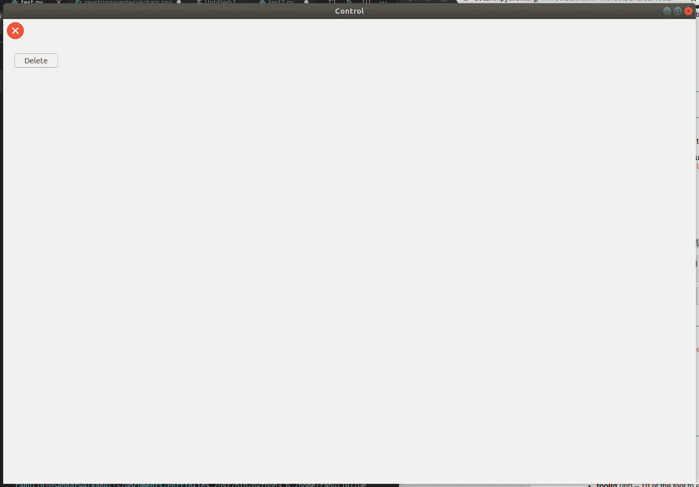

# wx Tyson–wx 中的 DeleteTool()函数。工具栏

> 原文:[https://www . geesforgeks . org/wxpython-delete tool-function-in-wx-toolbar/](https://www.geeksforgeeks.org/wxpython-deletetool-function-in-wx-toolbar/)

在本文中，我们将学习 wx 的 DeleteTool()函数。wxPython 的工具栏类。DeleteTool()从工具栏中删除指定的工具并将其删除。它使用工具标识符指定工具。

> **语法:** wx.toolbar.DeleteTool(self，toolid)
> 
> **如果工具被删除，则返回:**真，否则返回假。
> 
> **参数:**
> 
> | 参数 | 输入类型 | 描述 |
> | --- | --- | --- |
> | 椅子 | （同 Internationalorganizations）国际组织 | 一个整数，通过它可以在后续操作中识别工具。 |

**示例:**

```
import wx

class Example(wx.Frame):
    global count
    count = 0;
    def __init__(self, *args, **kwargs):
        super(Example, self).__init__(*args, **kwargs)

        self.InitUI()

    def InitUI(self):
        pnl = wx.Panel(self)
        self.toolbar = self.CreateToolBar()
        self.ptool = self.toolbar.AddTool(12, 
                                          'oneTool',
                                          wx.Bitmap('path/ wxPython / right.png'),
                                          shortHelp ="Simple Tool")
        self.ptool = self.toolbar.AddTool(13,
                                          'oneTool',
                                          wx.Bitmap('path / wxPython / wrong.png'),
                                          shortHelp ="Simple Tool")

        self.btn = wx.Button(pnl, label ='Delete', pos =(20, 20))

        self.btn.Bind(wx.EVT_BUTTON, self.Onclick)
        self.toolbar.Realize()
        self.SetSize((350, 250))
        self.SetTitle('Control')
        self.Centre()

    def Onclick(self, e):
        # delete tool using DeleteTool() function
        self.toolbar.DeleteTool(12)

def main():

    app = wx.App()
    ex = Example(None)
    ex.Show()
    app.MainLoop()

if __name__ == '__main__':
    main()
```

**输出:**
*启动应用:*


*点击按钮:*
