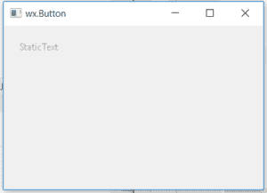

# wxPython–禁用 wxPython 中的静态文本

> 原文:[https://www . geesforgeks . org/wxpython-disable-static text-in-wxpython/](https://www.geeksforgeeks.org/wxpython-disable-statictext-in-wxpython/)

Python 提供了[**【wxpython】**](https://www.geeksforgeeks.org/python-wxpython-module-introduction/)****包**，允许我们创建高功能的图形用户界面。它是 python 的跨平台 GUI 工具包，凤凰版凤凰是改进的下一代 wxPython，它主要关注速度、可维护性和可扩展性。**

**在本文中，我们将学习如何禁用 statictext。我们可以使用 ***禁用()*** 方法来禁用与 ***wx 相关联的静态文本。statistex***t 类的 ***wxPython*** 。 ***Disable()*** 方法只是禁用一个 statictext，我们无法选择该文本。**

**Disable()函数不接受参数。** 

> ****语法:** wx。静态文本。禁用()**
> 
> ****参数:** Disable()函数不接受参数。**

****例:**** 

## **蟒蛇 3**

```
# importing wx library
import wx

# create an Example class
class Example(wx.Frame):
    # constructor
    def __init__(self, *args, **kwargs):
        super(Example, self).__init__(*args, **kwargs)

        # method calling
        self.InitUI()

    # method for user interface creation
    def InitUI(self):
        self.locale = wx.Locale(wx.LANGUAGE_ENGLISH)

        # create parent panel for button
        self.pnl = wx.Panel(self)

        # create statictext at point (20,20)
        self.st = wx.StaticText(self.pnl,
                                id = 1,
                                label = "Button")

        # disable statictext
        self.st.Disable()

        self.SetSize((350, 250))
        self.SetTitle('wx.Button')
        self.Centre()

# main function
def main():
  # create an App object
  app = wx.App()

  # create an Example object
  ex = Example(None)
  ex.Show()

  # running an app
  app.MainLoop()

# Driver code
if __name__ == '__main__':
  # main function call
  main()
```

****输出:**** 

****