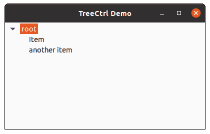

# wx python–wx 中的 EditLabel()方法。tree ctrl〔t1〕

> 哎哎哎:# t0]https://www . geeksforgeeks . org/wx python-editlabel-method-in-wx-tree ctrl/

在本文中，我们将学习与 wx 相关联的 EditLabel()方法。wxPython 的 TreeCtrl 类。开始编辑给定项目的标签。

该函数生成一个 EVT 树开始标签编辑事件，该事件可以被否决，这样就不会出现文本控件进行就地编辑。

如果用户更改了标签(即，他/她没有按下 ESC 或离开文本控件而没有更改)，将发送一个 END _ 树 _ 结束 _ 标签 _ 编辑事件，该事件也可以被否决。

> **语法:** wx。TreeCtrl.EditLabel(自我、项目)
> 
> **参数:**
> 
> <figure class="table">
> 
> | **参数** | **类型** | **描述** |
> | 项目 | wx(地名)。TreeItemId(树项目 Id) | 我们要与 editlabel 关联的项。 |
> 
> </figure>

**代码示例:**

## 蟒蛇 3

```
import wx

class MyTree(wx.TreeCtrl):

    def __init__(self, parent, id, pos, size, style):
        wx.TreeCtrl.__init__(self, parent, id, pos, size, style)

class TreePanel(wx.Panel):

    def __init__(self, parent):
        wx.Panel.__init__(self, parent)
        # create tree control in window
        self.tree = MyTree(self, wx.ID_ANY, wx.DefaultPosition, wx.DefaultSize,
                           wx.TR_HAS_BUTTONS)
        # CREATE TREE ROOT
        self.root = self.tree.AddRoot('root')
        self.tree.SetPyData(self.root, ('key', 'value'))

        # add item to root
        item = self.tree.AppendItem(self.root, "Item")
        item2 = self.tree.AppendItem(self.root, "Item")

        # expand root
        self.tree.Expand(self.root)

        # start editlabel
        self.tree.EditLabel(item2)

        sizer = wx.BoxSizer(wx.VERTICAL)
        sizer.Add(self.tree, 0, wx.EXPAND)
        self.SetSizer(sizer)

class MainFrame(wx.Frame):

    def __init__(self):
        wx.Frame.__init__(self, parent = None, title ='TreeCtrl Demo')
        panel = TreePanel(self)
        self.Show()

if __name__ == '__main__':
    app = wx.App(redirect = False)
    frame = MainFrame()
    app.MainLoop()
```

**输出:**

