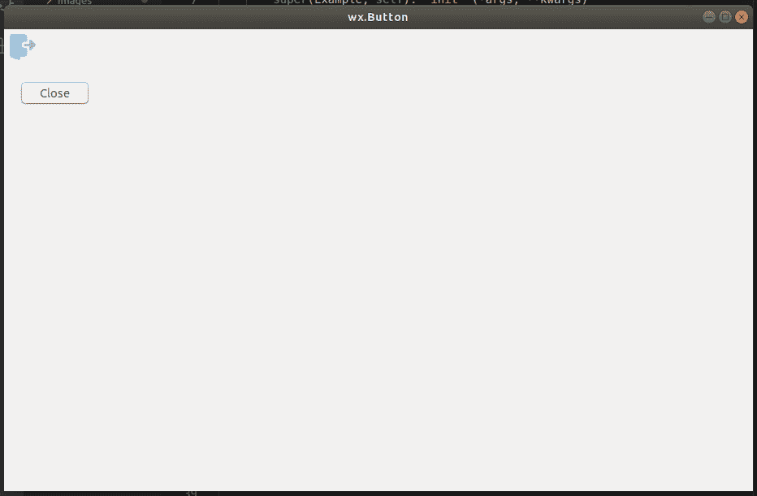

# wx Tyson–wx 中的 EnableTool()函数。工具栏

> 原文:[https://www . geesforgeks . org/wxpython-enable tool-function-in-wx-toolbar/](https://www.geeksforgeeks.org/wxpython-enabletool-function-in-wx-toolbar/)

在本文中，我们将学习 wx 类的 EnableTool()函数。wxPython 的工具栏。EnableTool 用于启用或禁用(使可点击和不可点击)工具栏中的工具。

> **语法:**
> 
> ```
> wx.ToolBar.EnableTool(self, toolid, enable)
> 
> ```
> 
> **参数:**
> 
> | 参数 | 输入类型 | 描述 |
> | --- | --- | --- |
> | 椅子 | （同 Internationalorganizations）国际组织 | 传递给添加工具的要启用或禁用的工具的标识。 |
> | 使能够 | 弯曲件 | 如果为真，则启用该工具，否则禁用它。 |

**代码示例:**

```
import wx

class Example(wx.Frame):

    def __init__(self, *args, **kwargs):
        super(Example, self).__init__(*args, **kwargs)

        self.InitUI()

    def InitUI(self):
        pnl = wx.Panel(self)
        self.toolbar = self.CreateToolBar()
        qtool = self.toolbar.AddTool(12, 'Quit', wx.Bitmap('/Desktop/wxPython/signs.png'))
        self.toolbar.Realize()

        self.Bind(wx.EVT_TOOL, self.OnQuit, qtool)

        self.SetSize((350, 250))
        self.SetTitle('Simple toolbar')
        self.Centre()
        self.btn = wx.Button(pnl, label ='Disable', pos =(20, 20))

        self.btn.Bind(wx.EVT_BUTTON, self.Onclick)

        self.SetSize((350, 250))
        self.SetTitle('wx.Button')
        self.Centre()

    def OnQuit(self, e):
        self.Close()

    def Onclick(self, e):
        # disable tool using EnableTool
        self.toolbar.EnableTool(12, False)

def main():

    app = wx.App()
    ex = Example(None)
    ex.Show()
    app.MainLoop()

if __name__ == '__main__':
    main()
```

**输出:**
