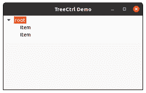

# wxPython–wx 中的 Expand()方法。TreeCtrl

> 原文:[https://www . geesforgeks . org/wxpython-expand-method-in-wx-tree ctrl/](https://www.geeksforgeeks.org/wxpython-expand-method-in-wx-treectrl/)

在本文中，我们将学习与 wx 相关联的 Expand()方法。wxPython 的 TreeCtrl 类。Expand()方法用于展开和显示树控件中特定项的子节点。

该函数将树节点项作为我们要扩展到的参数。

> **语法:** wx。展开(自身，项目)

**参数:**

<figure class="table">

| **参数** | **类型** | **描述** |
| 项目 | wx(地名)。TreeItemId(树项目 Id) | 我们要与 editlabel 关联的项。 |

</figure>

**代码示例:**

## 计算机编程语言

```py
import wx 

class MyTree(wx.TreeCtrl): 

    def __init__(self, parent, id, pos, size, style): 
        wx.TreeCtrl.__init__(self, parent, id, pos, size, style) 

class TreePanel(wx.Panel): 

    def __init__(self, parent): 
        wx.Panel.__init__(self, parent) 

        # create tree control in window 
        self.tree = MyTree(self, wx.ID_ANY, wx.DefaultPosition, 
                           wx.DefaultSize, wx.TR_HAS_BUTTONS) 

        # CREATE TREE ROOT 
        self.root = self.tree.AddRoot('root') 
        self.tree.SetPyData(self.root, ('key', 'value')) 

        # add item to root 
        item = self.tree.AppendItem(self.root, "Item") 
        item2 = self.tree.AppendItem(self.root, "Item") 

        # expand root 
        self.tree.Expand(self.root) 

        sizer = wx.BoxSizer(wx.VERTICAL) 
        sizer.Add(self.tree, 0, wx.EXPAND) 
        self.SetSizer(sizer) 

class MainFrame(wx.Frame): 

    def __init__(self): 
        wx.Frame.__init__(self, parent = None, title ='TreeCtrl Demo') 
        panel = TreePanel(self) 
        self.Show() 

if __name__ == '__main__': 
    app = wx.App(redirect = False) 
    frame = MainFrame() 
    app.MainLoop()
```

**输出:**

