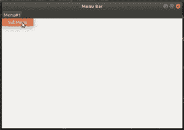

# wx xpython–wx 中的 FindMenuItem()函数。菜单栏

> 原文:[https://www . geesforgeks . org/wxpython-find menuitem-function-in-wx-menubar/](https://www.geeksforgeeks.org/wxpython-findmenuitem-function-in-wx-menubar/)

在本文中，我们将了解 wx 中存在的 FindMenuItem()函数。wxPython 的菜单栏类。FindMenuItem()用于返回项目标识符。FindMenuItem()接受两个参数，即菜单标题和子菜单项字符串。

> **语法:**
> 
> ```
> wx.MenuBar.FindMenuItem(self, menuString, itemString)
> ```
> 
> **参数:**
> 
> <figure class="table">
> 
> | 参数 | 输入类型 | 描述 |
> | --- | --- | --- |
> | 测量 | 线 | 要查找的菜单标题。 |
> | 项目字符串 | 线 | 要查找的项目。 |
> 
> </figure>
> 
> **返回:** FindMenuItem()返回菜单项标识符，即 wx。如果没有找到，则为未找到。

**代码示例:**

## 蟒蛇 3

```
import wx

class Example(wx.Frame):

    def __init__(self, *args, **kwargs):
        super(Example, self).__init__(*args, **kwargs)

        self.InitUI()

    def InitUI(self):

        # create MenuBar using MenuBar() function
        menubar = wx.MenuBar()

        # add menu to MenuBar
        fm1 = wx.Menu()
        fileitem = fm1.Append(20, "Item # 1")
        menubar.Append(fm1, '&Menu # 1')
        self.SetMenuBar(menubar)
        self.SetSize((300, 200))
        self.SetTitle('Menu Bar')

        # get id identifier of submenu item
        id = menubar.FindMenuItem("&Menu # 1", "Item # 1")
        print(id)   

def main():
    app = wx.App()
    ex = Example(None)
    ex.Show()
    app.MainLoop()

if __name__ == '__main__':
    main()
```

**输出:**



**命令行输出:**

```
20
```