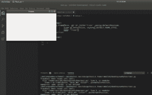

# wxPython–Python 中的 Frame()构造函数

> 原文:[https://www . geesforgeks . org/wxpython-frame-构造函数-in-python/](https://www.geeksforgeeks.org/wxpython-frame-constructor-in-python/)

在本文中，我们将了解 wxPython 中的 frame()构造函数。frame()构造函数是 wx 的构造函数。wxPython 的框架类。此构造函数用于设置框架的不同属性。

> **语法:**
> 
> ```
> wx.Frame(parent, id=ID_ANY, title="", pos=DefaultPosition,
>          size=DefaultSize, style=DEFAULT_FRAME_STYLE, name=FrameNameStr)
> ```
> 
> **参数:**
> 
> <figure class="table">
> 
> | 参数 | 输入类型 | 描述 |
> | --- | --- | --- |
> | 父母 | wx。窗户 | 父窗口。不应该是无。 |
> | 身份证明（identification） | wx.窗口标识 | 控件标识符。值-1 表示默认值。 |
> | 标题 | 线 | 框架的标题。 |
> | 刷卡机 | wx。要点 | 窗口位置。 |
> | 大小 | wx。窗户 | 窗口大小。 |
> | 风格 | 长的 | 窗口样式。 |
> | 名字 | 线 | 窗口名称。 |
> 
> </figure>

**代码:**

## 蟒蛇 3

```
# import wxPython
import wx

app = wx.App()

# create frame using Frame() constructor
frame = wx.Frame(None, id = 10, title ="Frame",
                      pos = wx.DefaultPosition,
                         size = wx.DefaultSize,
                style = wx.DEFAULT_FRAME_STYLE,
                               name = "frame")

# show frame
frame.Show(True)

app.MainLoop()
```

**输出:**

