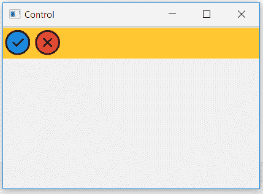

# wxPython–获取工具栏的背景颜色

> 原文:[https://www . geesforgeks . org/wxpython-get-background-color-of-toolbar/](https://www.geeksforgeeks.org/wxpython-get-background-colour-of-toolbar/)

在本文中，我们将了解如何获得 wx.ToolBar 的背景颜色。函数的作用是:返回窗口的背景颜色。

> **语法:** wx。工具栏。获取背景颜色(自身)
> 
> **参数:**该方法不需要参数。
> 
> **返回类型:** wx。颜色

**代码示例:**

```
import wx

class Example(wx.Frame):
    global count
    count = 0;

    def __init__(self, *args, **kwargs):
        super(Example, self).__init__(*args, **kwargs)

        self.InitUI()

    def InitUI(self):
        self.locale = wx.Locale(wx.LANGUAGE_ENGLISH)
        pnl = wx.Panel(self)
        self.toolbar = self.CreateToolBar()

        # Add tools to toolbar
        ptool = self.toolbar.AddTool(12, 'oneTool',
                                     wx.Bitmap('right.png'),
                                     wx.Bitmap('wrong.png'), shortHelp ="Simple Tool")

        qtool = self.toolbar.AddTool(12, 'oneTool', wx.Bitmap('wrong.png'),
                                     wx.Bitmap('wrong.png'), shortHelp ="Simple Tool")

        # change background colour of toolbar
        self.toolbar.SetBackgroundColour((255, 200, 50, 255))

        # print background colour of toolbar (r, g, b, a)
        print(self.toolbar.GetBackgroundColour())

        self.toolbar.Realize()
        self.SetSize((350, 250))
        self.SetTitle('Control')
        self.Centre()

def main():
    app = wx.App()
    ex = Example(None)
    ex.Show()
    app.MainLoop()

if __name__ == '__main__':
    main()
```

**控制台输出:**
(255，200，50，255)

**输出窗口:**
