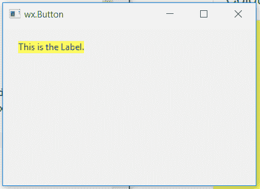

# wxPython–获取 StaticText 的默认属性

> 原文:[https://www . geesforgeks . org/wxpython-get-default-attributes-of-static text/](https://www.geeksforgeeks.org/wxpython-get-default-attributes-of-statictext/)

在本文中，我们将学习如何获得静态文本的不同属性，如背景、前景色和字体。我们使用 GetClassDefaultAttributes()函数来获取一个 wx.VisualAttributes 的对象，它可能会也可能不会以 variant 作为参数。

> **语法:**
> wx。static text . get class default attributes()
> 或
> wx。static text . get class default attributes(variant = window _ variant _ normal)
> 
> **参数:**
> 
> <figure class="table">
> 
> | 参数 | 输入类型 | 描述 |
> | --- | --- | --- |
> | 不同的 | WindowVariant | 静态文本的变体。 |
> 
> </figure>
> 
> **返回类型:**
> wx。可视化属性

**代码示例:**

## 蟒蛇 3

```
import wx

class Example(wx.Frame):

    def __init__(self, *args, **kwargs):
        super(Example, self).__init__(*args, **kwargs)
        self.InitUI()

    def InitUI(self):
        self.locale = wx.Locale(wx.LANGUAGE_ENGLISH)
        self.pnl = wx.Panel(self)

        bmp = wx.Bitmap('right.png')
        # CREATE STATICTEXT AT POINT (20, 20)
        self.st = wx.StaticText(self.pnl, id = 1, label ="This is the Label.", pos =(20, 20),
                                size = wx.DefaultSize, style = wx.ST_ELLIPSIZE_MIDDLE, name ="statictext")

        self.st.SetBackgroundColour((255, 252, 92, 255))
        self.st.SetForegroundColour((14, 96, 150, 255))

        # GET DEFAULT ATTRIBUTES OBJECT
        v = self.st.GetClassDefaultAttributes();
        print(v.colBg)
        print(v.colFg)
        print(v.font)

        self.SetSize((350, 250))
        self.SetTitle('wx.Button')
        self.Centre()

def main():
    app = wx.App()
    ex = Example(None)
    ex.Show()
    app.MainLoop()

if __name__ == '__main__':
    main()
```

**控制台输出:**
(240，240，240，255)
(0，0，0，255)

**输出窗口:**

