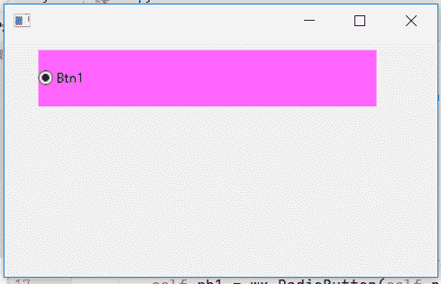

# wxPython–获取单选按钮窗口的大小

> 原文:[https://www . geesforgeks . org/wxpython-get-size-of-radio-button-window/](https://www.geeksforgeeks.org/wxpython-get-size-of-radio-button-window/)

在本文中，我们将了解如何在框架中显示单选按钮窗口的大小。为此，我们将使用与 wx 关联的 GetSize()函数。wxPython 的 RadioButton 类。函数的作用是:以像素为单位返回单选按钮的大小。
GetSize()函数不需要参数。

> **语法:** wx。单选按钮
> 
> **参数:** GetSize()函数不需要参数。
> 
> **返回类型:** wx。大小
> 
> **返回:**返回单选按钮的大小

**代码示例:**

```
import wx

APP_EXIT = 1

class Example(wx.Frame):

    def __init__(self, *args, **kwargs):
        super(Example, self).__init__(*args, **kwargs)

        self.InitUI()

    def InitUI(self):
        self.pnl = wx.Panel(self)

        # create radio button at position (30, 10)
        self.rb1 = wx.RadioButton(self.pnl, label ='Btn1',
                             pos =(30, 10), size =(100, 20))

        # change background colour
        self.rb1.SetBackgroundColour((255, 100, 255, 255))

        # change size to (300, 50)
        self.rb1.SetSize((300, 50))

        # print size of radio button
        print(self.rb1.GetSize())

def main():
    app = wx.App()
    ex = Example(None)
    ex.Show()
    app.MainLoop()

if __name__ == '__main__':
    main()
```

**控制台输出:**

```
(300, 50)

```

**输出窗口:**
