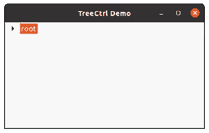

# wx 中的 wxPython–GetBoundingRect()方法。TreeCtrl

> 原文:[https://www . geesforgeks . org/wxpython-getboundingrect-method-in-wx-tree ctrl/](https://www.geeksforgeeks.org/wxpython-getboundingrect-method-in-wx-treectrl/)

在本文中，我们将学习 wx.TreeCtrl 中的 GetBoundingRect()方法。如果“仅文本”为“真”，则只返回项目标签周围的矩形，否则也会考虑项目的图像。如果未成功检索到矩形，返回值可能为“无”，例如如果该项当前不可见。

GetBoundingRect()接受两个参数 item 和 textOnly。

> **语法:**
> 
> wx.TreeCtrl.GetBoundingRect（self， item， textOnly）

**参数:**

<figure class="table">

| **参数** | **类型** | **描述** |
| 项目 | wx(地名)。TreeItemId(树项目 Id) | 我们希望确保可见的项目。 |
| 文本仅 | 布尔 | 如果“仅文本”为真，则只返回项目标签周围的矩形，否则也会考虑项目的图像。 |

</figure>

## 计算机编程语言

```py
import wx 

class MyTree(wx.TreeCtrl): 

    def __init__(self, parent, id, pos, size, style): 
        wx.TreeCtrl.__init__(self, parent, id, pos, size, style) 

class TreePanel(wx.Panel): 

    def __init__(self, parent): 
        wx.Panel.__init__(self, parent) 

        # create tree control in window 
        self.tree = MyTree(self, wx.ID_ANY, wx.DefaultPosition, wx.DefaultSize, 
                        wx.TR_HAS_BUTTONS) 

        # CREATE TREE ROOT 
        self.root = self.tree.AddRoot('root') 
        self.tree.SetPyData(self.root, ('key', 'value')) 

        # add item to root 
        item = self.tree.AppendItem(self.root, "Item") 
        item2 = self.tree.AppendItem(self.root, "Item") 
        item3 = self.tree.AppendItem(item, "SubItem")
        item4 = self.tree.AppendItem(item, "SubItem")
        item5 = self.tree.AppendItem(item2, "SubItem")
        item6 = self.tree.AppendItem(item, "SubItem")

        # print bound rectangle pyObject
        print(self.tree.GetBoundingRect(item, False))

        # expand all nodes of the tree
        self.tree.ExpandAllChildren(item) 

        sizer = wx.BoxSizer(wx.VERTICAL) 
        sizer.Add(self.tree, 0, wx.EXPAND) 
        self.SetSizer(sizer) 

class MainFrame(wx.Frame): 

    def __init__(self): 
        wx.Frame.__init__(self, parent = None, title ='TreeCtrl Demo') 
        panel = TreePanel(self) 
        self.Show() 

if __name__ == '__main__': 
    app = wx.App(redirect = False) 
    frame = MainFrame() 
    app.MainLoop()
```

**输出:**

```py
(0, 0 , 10, 10)
```

