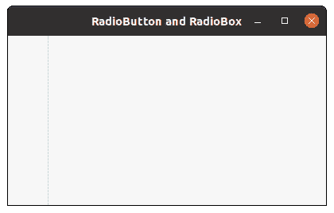

# wx xpython–wx 中的 GetClassDefaultAttributes()方法。静态线

> 原文:[https://www . geesforgeks . org/wxpython-getclassdefaultattributes-method-in-wx-static line/](https://www.geeksforgeeks.org/wxpython-getclassdefaultattributes-method-in-wx-staticline/)

在本文中，我们将了解与 wx 相关联的 GetClassDefaultAttributes()函数。wxPython 的 StaticLine 类。GetClassDefaultAttributes()函数用于返回 wx。VisualAttributes 对象，用于背景色、前景色和字体等属性。

> **语法:** wx。
> 参数
> 
> <figure class="table">
> 
> | 参数 | 输入类型 | 描述 |
> | --- | --- | --- |
> | 不同的 | WindowVariant | 用于静态线路的变体 |
> 
> </figure>
> 
> **返回类型:**
> wx。可视化属性

**代码示例:**

## 蟒蛇 3

```py
import wx

class FrameUI(wx.Frame):

    def __init__(self, parent, title):
        super(FrameUI, self).__init__(parent, title = title, size =(300, 200))

        # function for in-frame components
        self.InitUI()

    def InitUI(self):
        # parent panel for radio box
        pnl = wx.Panel(self)

        # list of choices
        hlist = ['Item One', 'Item Two']
        vlist =['Item One', 'Item Two']

        # create vertical line from point (50, 0) t0 (50, 250)
        self.sl = wx.StaticLine(pnl, 2,  pos =(50, 0), size = (1, 250), 
                                             style = wx.LI_VERTICAL)

        # create visual attributes instance fr static line
        att = self.sl.GetClassDefaultAttributes()

        # print background and foregound colours
        print (att.colBg)
        print (att.colFg)

        # set frame in centre
        self.Centre()
        # set size of frame
        self.SetSize((400, 250))
        # show output frame
        self.Show(True)

# wx App instance
ex = wx.App()
# Example instance
FrameUI(None, 'RadioButton and RadioBox')
ex.MainLoop()
```

**控制台输出:**

```py
(0, 0, 0, 26)
(61, 61, 61, 255)
```

**输出窗口:**

