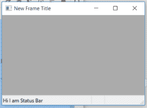

# wx xpython–wx 中的 GetFieldRect()函数。状态栏

> 原文:[https://www . geesforgeks . org/wxpython-getfield rect-function-in-wx-status bar/](https://www.geeksforgeeks.org/wxpython-getfieldrect-function-in-wx-statusbar/)

在本文中，我们将学习与 wx 相关联的 GetFieldRect()函数。wxPython 的 StatusBar 类。函数的作用是:返回字段内部边框的大小和位置。

> **语法:** wx。StatusBar.GetFieldRect()
> 
> **参数:**
> 
> | 参数 | 输入类型 | 描述 |
> | --- | --- | --- |
> | 设计 | wx。基本框架 | 框架与菜单栏匹配 |
> 
> **返回类型:** wx。矩形

**代码示例:**

```
import wx

class Example(wx.Frame):

    def __init__(self, *args, **kwargs):
        super(Example, self).__init__(*args, **kwargs)

        self.InitUI()

    def InitUI(self):

        self.locale = wx.Locale(wx.LANGUAGE_ENGLISH)
        self.statusbar = wx.StatusBar()
        self.statusbar.Create(self, id = 1, style = wx.STB_DEFAULT_STYLE,
                                                     name = "Status Bar")

        self.SetStatusBar(self.statusbar)
        self.SetSize((350, 250))
        self.statusbar.SetFieldsCount(2)
        self.statusbar.SetStatusWidths([200, 1])
        self.statusbar.SetStatusText("Hi I am Status Bar")

        # GET wx.Rect OBJECT
        field = self.statusbar.GetFieldRect(1)

        # PRINT field
        print(field)

        self.SetTitle('New Frame Title')
        self.Centre()

def main():
    app = wx.App()
    ex = Example(None)
    ex.Show()
    app.MainLoop()

if __name__ == '__main__':
    main()
```

**控制台输出:**

```
(210, 2, 30, 20)

```

**输出窗口:**
