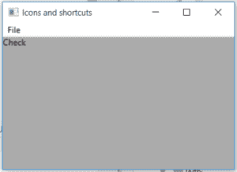

# wx python–wx 中的 GetItemLabelText()函数。MenuItem

> 原文:[https://www . geeksforgeeks . org/wxpython-getitemlatext-function-in-wx-menuitem/](https://www.geeksforgeeks.org/wxpython-getitemlabeltext-function-in-wx-menuitem/)

在本文中，我们将学习与 wx 相关联的 GetItemLabelText()函数。wxPython 的 MenuItem 类。GetItemLabelText()函数用于简单地返回与菜单项相关联的文本，没有任何加速器字符。
getitemlatext()函数不需要参数。

> **语法:**
> 
> ```
> wx.MenuItem.GetItemLabelText(self)
> 
> ```
> 
> **参数:**
> 
> ```
> No parameters are required by GetItemLabelText() function
> 
> ```
> 
> **返回类型:**
> 
> ```
> string
> 
> ```

**代码示例:**

```
import wx

class Example(wx.Frame):

    def __init__(self, *args, **kwargs):
        super(Example, self).__init__(*args, **kwargs)

        self.InitUI()

    def InitUI(self):
        self.locale = wx.Locale(wx.LANGUAGE_ENGLISH)

        self.menubar = wx.MenuBar()
        self.fileMenu = wx.Menu()
        self.item = wx.MenuItem(self.fileMenu, 1, '&Check', helpString ="Check Help")
        self.item.SetBitmap(wx.Bitmap('right.png'))
        self.fileMenu.Append(self.item)
        self.menubar.Append(self.fileMenu, '&File')
        self.SetMenuBar(self.menubar)
        # label of menu item
        label = self.item.GetItemLabelText()
        # print label of menuitem
        print(label)
        self.SetSize((350, 250))
        self.SetTitle('Icons and shortcuts')
        self.Centre()

def main():
    app = wx.App()
    ex = Example(None)
    ex.Show()
    app.MainLoop()

if __name__ == '__main__':
    main()
```

**输出:**

```
Check

```

**输出窗口:**
