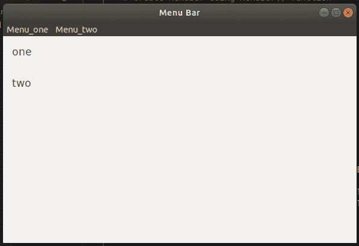

# wx 中的 wxPython–GetLabel()函数。菜单栏

> 原文:[https://www . geesforgeks . org/wxpython-getlabel-function-in-wx-menu bar/](https://www.geeksforgeeks.org/wxpython-getlabel-function-in-wx-menubar/)

`GetLabel()`是 wx 中存在的另一个函数。wxPython 的菜单栏类。`GetLabel()`功能用于返回菜单栏中菜单内的菜单标签。GetLabel()函数只以 id 为参数，返回菜单项的字符串 Label。

> **语法:**
> 
> ```py
> wx.MenuBar.GetLabel(self, id)
> 
> ```
> 
> **参数:**
> 
> | 参数 | 输入类型 | 描述 |
> | --- | --- | --- |
> | 身份证明（identification） | （同 Internationalorganizations）国际组织 | 菜单项标识符。 |
> 
> **返回:**菜单项标签，如果没有找到该项，则返回空字符串。

**代码示例:**

让我们返回菜单栏中菜单一和菜单二中的菜单项标签。

```py
import wx

class Example(wx.Frame):

    def __init__(self, *args, **kw):
        super(Example, self).__init__(*args, **kw)

        # create MenuBar using MenuBar() function
        menubar = wx.MenuBar()

        # add menu to MenuBar
        fm1 = wx.Menu()
        fileitem = fm1.Append(20, "one")

        fm2 = wx.Menu()
        fileitem2 = fm2.Append(21, "two")
        menubar.Append(fm1, '&Menu_one')
        menubar.Append(fm2, '&Menu_two')
        self.SetMenuBar(menubar)
        self.SetSize((300, 200))
        self.SetTitle('Menu Bar')
        pnl = wx.Panel(self)
        vbox = wx.BoxSizer(wx.VERTICAL)

        font = wx.Font(13, wx.DEFAULT, wx.NORMAL, wx.DEFAULT)

        st1 = wx.StaticText(pnl, label = menubar.GetLabel(20), style = wx.ALIGN_LEFT)
        st2 = wx.StaticText(pnl, label = menubar.GetLabel(21), style = wx.ALIGN_LEFT)

        st1.SetFont(font)
        st2.SetFont(font)

        vbox.Add(st1, flag = wx.ALL, border = 15)
        vbox.Add(st2, flag = wx.ALL, border = 15)

        pnl.SetSizer(vbox)

def main():
    app = wx.App()
    ex = Example(None)
    ex.Show()
    app.MainLoop()
```

**输出:**

