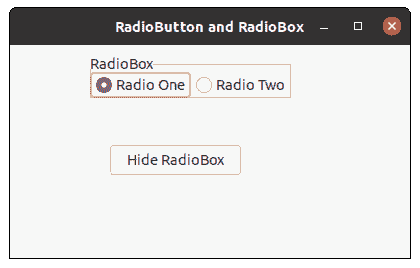
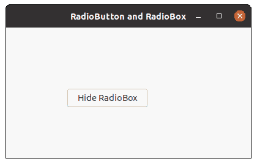

# wxPython–从框架中隐藏无线电盒

> 原文:[https://www . geesforgeks . org/wxpython-hide-radio-box-from-the-frame/](https://www.geeksforgeeks.org/wxpython-hide-radio-box-from-the-frame/)

在本文中，我们将学习如何隐藏框架中的整个无线电盒小部件。为此，我们将使用 Hide()函数。Hide()函数不需要参数。Hide()函数仅隐藏无线电盒小部件，而不从窗口中移除。此外，无线电盒内物品的价值保持不变。

> **语法:** wx。无线电盒。隐藏(自我)
> 
> **参数**隐藏()功能不需要参数。
> 
> **返回类型:** bool

**代码示例:**

```
import wx

class FrameUI(wx.Frame):

    def __init__(self, parent, title):
        super(FrameUI, self).__init__(parent, title = title, size =(300, 200))

        # function for in-frame components
        self.InitUI()

    def InitUI(self):
        # parent panel for radio box
        pnl = wx.Panel(self)

        # list of choices
        lblList = ['Radio One', 'Radio Two']

        # create radio box containing above list
        self.rbox = wx.RadioBox(pnl, label ='RadioBox', pos =(80, 10), choices = lblList,
                                          majorDimension = 1, style = wx.RA_SPECIFY_ROWS)

        # create a button in the frame
        self.btn = wx.Button(pnl, 1, "Hide RadioBox", pos =(100, 100));

        # bind a function with button
        self.btn.Bind(wx.EVT_BUTTON, self.onclick)

        # set frame in centre
        self.Centre()
        # set size of frame
        self.SetSize((400, 250))
        # show output frame
        self.Show(True)

    def onclick(self, e):
        # hide radio box from the frame
        self.rbox.Hide()

# wx App instance
ex = wx.App()
# Example instance
FrameUI(None, 'RadioButton and RadioBox')
ex.MainLoop()
```

**输出窗口:**


*前点击按钮*



点击按钮后