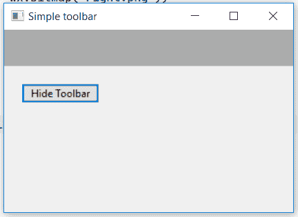

# wxPython–从框架中隐藏工具栏

> 原文:[https://www . geesforgeks . org/wxpython-隐藏-框架工具栏/](https://www.geeksforgeeks.org/wxpython-hide-toolbar-from-frame/)

在本文中，我们将学习如何隐藏框架中的工具栏。为此，我们将使用 Hide()函数。Hide()函数只是隐藏工具栏窗口，而不是像 Drop()函数那样删除它。使用 Show()功能可以再次显示隐藏工具栏。

> **语法:** wx。工具栏。隐藏(自我)
> 
> **参数:**Hide()函数不需要参数。
> 
> **返回类型:** bool

**代码示例:**

```
import wx

class Example(wx.Frame):
    global count
    count = 0;

    def __init__(self, *args, **kwargs):
        super(Example, self).__init__(*args, **kwargs)

        self.InitUI()

    def InitUI(self):
        self.locale = wx.Locale(wx.LANGUAGE_ENGLISH)
        self.toolbar = self.CreateToolBar()
        tool = self.toolbar.AddTool(wx.ID_ANY, 'First',
                                    wx.Bitmap('right.png'))
        self.toolbar.Realize()

        # panel for button
        self.pnl = wx.Panel(self)

        # button
        self.btn = wx.Button(self, label ='Hide Toolbar', pos =(20, 20))

        # bind event with button
        self.btn.Bind(wx.EVT_BUTTON, self.onclick)

        self.SetSize((350, 250))
        self.SetTitle('Simple toolbar')
        self.Centre()

    def onclick(self, e):
        # hide toolbar
        self.toolbar.Hide()

def main():
    app = wx.App()
    ex = Example(None)
    ex.Show()
    app.MainLoop()

if __name__ == '__main__':
    main()
```

**输出窗口:**

*点击按钮*前


*后点击按钮*