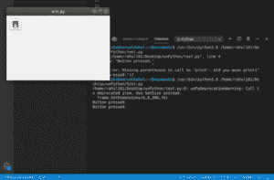

# wxPython–Python 中按钮上的图像

> 原文:[https://www . geesforgeks . org/wxpython-python 中按钮图像/](https://www.geeksforgeeks.org/wxpython-image-on-button-in-python/)

在这篇特别的文章中，我们将学习如何使用 wxPython 向图形用户界面中的按钮添加图像。这可以使用 wx 中`wx.BitmapButton class`的`BitmapButton()`构造函数来实现。

支持以下窗口样式:

*   wx。BU_LEFT:左对齐位图标签。
*   wx。BU_TOP:将位图标签与按钮顶部对齐。
*   wx。右对齐位图标签。
*   wx。BU_BOTTOM:将位图标签与按钮底部对齐。

> **语法:**
> 
> ```py
> wx.StaticText(self, parent, id=ID_ANY, bitmap=NullBitmap, 
>               pos=DefaultPosition, size=DefaultSize, style=0, 
>            validator= DefaultVadator, name=StaticTextNameStr)
> 
> ```
> 
> **参数:**
> 
> | 参数 | 输入类型 | 描述 |
> | --- | --- | --- |
> | 父母 | wx。窗户 | 父窗口。不应该是无。 |
> | 身份证明（identification） | wx.窗口标识 | 控件标识符。值-1 表示默认值。 |
> | 位图 | wx(地名)。点阵图(Bitmap) | 要显示的位。 |
> | 刷卡机 | wx。要点 | 窗口位置。 |
> | 大小 | wx。窗户 | 窗口大小。 |
> | 风格 | 长的 | 窗口样式。 |
> | 验证器 | wx。验证器 | 窗口验证器。 |
> | 名字 | 线 | 窗口名称。 |

**示例代码:**

```py
# import wxPython
import wx

# event function for button
def onButton(event):
    print("Button pressed.")

app = wx.App()
frame = wx.Frame(None, -1, 'win.py')
frame.SetDimensions(0, 0, 200, 70)
panel = wx.Panel(frame, wx.ID_ANY)

# open image from disk
bmp = wx.Bitmap("/home/rahul101/Desktop/wxPython/images.png", wx.BITMAP_TYPE_ANY)
# create image button using BitMapButton constructor
button = wx.BitmapButton(panel, id = wx.ID_ANY, bitmap = bmp,
                          size =(bmp.GetWidth()+10, bmp.GetHeight()+10))

button.Bind(wx.EVT_BUTTON, onButton)
button.SetPosition((10, 10))

frame.Show()
frame.Centre()
app.MainLoop()
```

**输出:**
