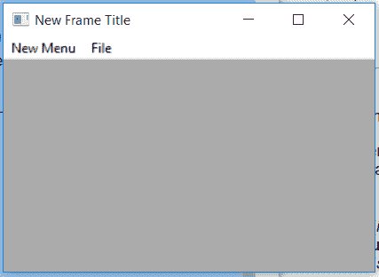

# wxPython–在 wx 中插入()函数。菜单栏

> 原文:[https://www . geesforgeks . org/wxpython-insert-function-in-wx-menu bar/](https://www.geeksforgeeks.org/wxpython-insert-function-in-wx-menubar/)

在本文中，我们将学习与 wx 相关联的 Insert()函数。wxPython 的菜单栏类。所以 Insert()函数是 wx 中非常重要的一个函数。菜单栏类。函数的作用是:将指定位置的菜单插入菜单栏。

在位置 0 插入菜单将在它的最开始插入它，在位置 GetMenuCount 插入与调用 Append 相同。

> **语法:** wx。菜单栏。插入(自身、位置、菜单、标题)
> 
> **参数:**
> 
> | 参数 | 输入类型 | 描述 |
> | --- | --- | --- |
> | 刷卡机 | （同 Internationalorganizations）国际组织 | 菜单栏中新菜单的位置 |
> | 菜单 | wx 菜单 | 要添加的菜单。wx。菜单栏拥有菜单并将释放它。 |
> | 标题 | 线 | 菜单的标题。 |

**代码示例:**

```
import wx

class Example(wx.Frame):

    def __init__(self, *args, **kwargs):
        super(Example, self).__init__(*args, **kwargs)

        self.InitUI()

    def InitUI(self):

        self.locale = wx.Locale(wx.LANGUAGE_ENGLISH)
        self.menubar = wx.MenuBar()
        self.fileMenu = wx.Menu()
        self.fileMenu2 = wx.Menu()
        self.item = wx.MenuItem(self.fileMenu, 1, '&Check',
                                 helpString ="Check Help")
        self.item.SetBitmap(wx.Bitmap('right.png'))
        self.fileMenu.Append(self.item)
        self.menubar.Append(self.fileMenu, '&File')

        # INSERT A NEW MENU IN MENUBAR AT POSITION 0
        self.menubar.Insert(0, self.fileMenu2, '&New Menu')
        self.SetMenuBar(self.menubar)
        self.SetSize((350, 250))
        self.SetTitle('New Frame Title')
        self.Centre()

def main():
    app = wx.App()
    ex = Example(None)
    ex.Show()
    app.MainLoop()

if __name__ == '__main__':
    main()
```

**输出:**
