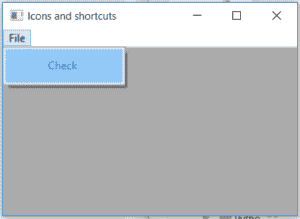

# wx xpython–wx 中的 IsChecked()函数。菜单项

> 原文:[https://www . geeksforgeeks . org/wxpython-ischecked-function-in-wx-menuitem/](https://www.geeksforgeeks.org/wxpython-ischecked-function-in-wx-menuitem/)

在本文中，我们将学习与 wx 相关联的 IsChecked()函数。wxPython 的 MenuItem 类。如果项目被选中，则 IsChecked(self)返回 True，如果项目未被选中，则返回 False。
该功能不需要参数。

> **语法:**
> 
> ```py
> wx.IsChecked(self)
> 
> ```
> 
> **参数:**
> 
> ```py
> No parameters are required by IsChecked function.
> 
> ```
> 
> **返回类型:**
> 
> ```py
> bool
> 
> ```

**代码示例:**

```py
import wx

class Example(wx.Frame):

    def __init__(self, *args, **kwargs):
        super(Example, self).__init__(*args, **kwargs)

        self.InitUI()

    def InitUI(self):
        self.locale = wx.Locale(wx.LANGUAGE_ENGLISH)

        self.menubar = wx.MenuBar()
        self.fileMenu = wx.Menu()
        self.item = wx.MenuItem(self.fileMenu, 1, '&Check', helpString ="Check Help", kind = wx.ITEM_CHECK)
        self.item.SetBitmap(wx.Bitmap('right.png'))
        self.item.SetTextColour((79, 81, 230, 255))
        self.st = wx.StaticText(self, label ="", pos =(200, 200))
        self.fileMenu.Append(self.item)
        self.menubar.Append(self.fileMenu, '&File')
        self.SetMenuBar(self.menubar)

        self.Bind(wx.EVT_MENU, self.OnClick, id = 1)

        self.SetSize((350, 250))
        self.SetTitle('Icons and shortcuts')
        self.Centre()

    def OnClick(self, e):
        if self.item.IsChecked()== True:
            # print if item is checked
            print("Item is check")
        else:
            # print if item is not checked
            print("Item is not check")

def main():
    app = wx.App()
    ex = Example(None)
    ex.Show()
    app.MainLoop()

if __name__ == '__main__':
    main()
```

**听着:**

```py
Item is check
Item is not check

```

**输出窗口:**


