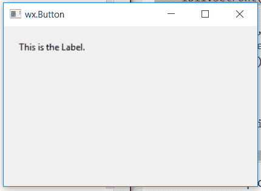

# wx xpython–wx 中的 IsEllipsized()函数。StaticText

> 原文:[https://www . geesforgeks . org/wxpython-isellipsized-function-in-wx-static text/](https://www.geeksforgeeks.org/wxpython-isellipsized-function-in-wx-statictext/)

在本文中，我们将了解与 wx 相关联的 IsEllipsized()函数。wxPython 的 StaticText 类。如果此控件的窗口样式包含 ST_ELLIPSIZE_START、ST_ELLIPSIZE_MIDDLE 或 ST_ELLIPSIZE_END 样式之一，则使用 IsEllipsized()函数返回 True。

> **语法:** wx。静态文本。静态化(自)
> 
> **参数:**不需要参数。
> 
> **返回类型:** bool

**代码示例:**

```
import wx

class Example(wx.Frame):

    def __init__(self, *args, **kwargs):
        super(Example, self).__init__(*args, **kwargs)
        self.InitUI()

    def InitUI(self):
        self.locale = wx.Locale(wx.LANGUAGE_ENGLISH)
        self.pnl = wx.Panel(self)

        bmp = wx.Bitmap('right.png')
        # CREATE STATICTEXT AT POINT (20, 20)
        self.st = wx.StaticText(self.pnl, id = 1, label ="This is the Label.",
                                pos =(20, 20), size = wx.DefaultSize, 
                                style = wx.ST_ELLIPSIZE_MIDDLE, name ="statictext")

        # CHECK ELLIPSIZED STYLE
        if(self.st.IsEllipsized()== True):
            print("Ellipsized")
        else:
            print("Not Ellipsized")
        self.SetSize((350, 250))
        self.SetTitle('wx.Button')
        self.Centre()

def main():
    app = wx.App()
    ex = Example(None)
    ex.Show()
    app.MainLoop()

if __name__ == '__main__':
    main()
```

**控制台输出:**

```
Ellipsized

```

**输出窗口:**
