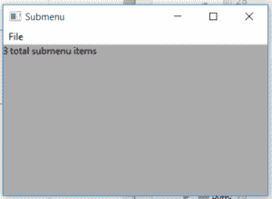

# wx Tyson–wx 中的 IsSubMenu()函数。菜单项

> 原文:[https://www . geesforgeks . org/wxpython-issubmenu-function-in-wx-menuitem/](https://www.geeksforgeeks.org/wxpython-issubmenu-function-in-wx-menuitem/)

在本文中，我们将了解与 wx 相关联的 IsSubMenu()函数。wxPython 的 MenuItem 类。IsSubMenu()函数只在项目是子菜单时返回 True，在项目不是子菜单时返回 False。
IsSubMenu()函数不需要参数。

> **语法:**
> 
> ```py
> wx.MenuItem.IsSubMenu(self)
> 
> ```
> 
> **参数:**
> 
> ```py
> No parameters are required by IsSubMenu() function.
> 
> ```
> 
> **返回类型:**
> 
> ```py
> bool
> 
> ```

**代码示例:**

```py
import wx

class Example(wx.Frame):

    def __init__(self, *args, **kwargs):
        super(Example, self).__init__(*args, **kwargs)

        self.InitUI()

    def InitUI(self):

        menubar = wx.MenuBar()

        fileMenu = wx.Menu()

        sm = wx.Menu()
        sm.Append(wx.ID_ANY, 'Submenu item 1')
        sm.Append(wx.ID_ANY, 'Submenu item 2')
        sm.Append(wx.ID_ANY, 'Submenu item 3')
        item = wx.MenuItem(fileMenu, 1, '&Check\tCtrl + c', helpString ="Check Help")
        item.SetSubMenu(sm)
        fileMenu.AppendMenu(wx.ID_ANY, 'I&mport', sm)

        n = item.IsSubMenu()
        # if item is sub menu
        if(n == True):
            print("Item is SubMenu Item")
        else:
            print("Item is not a SubMenu Item")
        menubar.Append(fileMenu, '&File')
        self.SetMenuBar(menubar)

        self.SetSize((350, 250))
        self.SetTitle('Submenu')
        self.Centre()

def main():

    app = wx.App()
    ex = Example(None)
    ex.Show()
    app.MainLoop()

if __name__ == '__main__':
    main()
```

**输出:**

```py
Item is SubMenu Item.

```

**输出窗口:**
