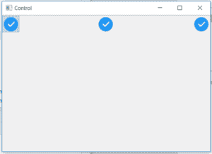
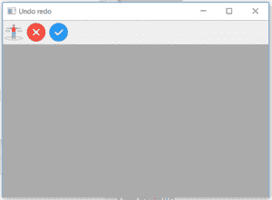

# wxPython |在 wx 中实现()功能。工具栏

> 原文:[https://www . geesforgeks . org/wxpython-implement-function-in-wx-toolbar/](https://www.geeksforgeeks.org/wxpython-realize-function-in-wx-toolbar/)

在本文中，我们将学习与 wx 相关联的 implement()函数。wxPython 的工具栏类。实现()函数，该函数应该在工具栏中完成任何操作后调用，如添加控件、添加工具、添加分色等..implement()函数不带参数。

> **语法:**
> 
> ```py
> wx.ToolBar.Realize(self)
> 
> ```
> 
> **参数:**
> 
> ```py
> Realize() function takes No parameters.
> 
> ```
> 
> **返回类型:**
> 
> ```py
> bool
> 
> ```

**代码示例 1:**

```py
import wx 

class Example(wx.Frame): 
    global count 
    count = 0; 
    def __init__(self, *args, **kwargs): 
        super(Example, self).__init__(*args, **kwargs) 

        self.InitUI() 

    def InitUI(self): 
        pnl = wx.Panel(self) 
        self.toolbar = self.CreateToolBar() 

        # Radio tool using AddTool() Function 
        ptool = self.toolbar.AddTool(12, 'oneTool',   
                                  wx.Bitmap('/home / wxPython / right.png'), 
                                  wx.Bitmap('/home / wxPython / wrong.png'),  
                                  kind = wx.ITEM_RADIO, shortHelp ="Simple Tool") 

        spc = self.toolbar.AddStretchableSpace() 

        # Check tool using AddTool() Function 
        qtool = self.toolbar.AddTool(12, 'oneTool',  wx.Bitmap('/home / wxPython / right.png'),  
                                                     wx.Bitmap('/home / wxPython / wrong.png'),  
                                             kind = wx.ITEM_CHECK, shortHelp ="Simple Tool") 

        spc = self.toolbar.AddStretchableSpace() 
        # Normal tool using AddTool() Function 
        rtool = self.toolbar.AddTool(12, 'oneTool',  wx.Bitmap('/home / wxPython / right.png'), 
                                                     wx.Bitmap('/home / wxPython / wrong.png'),  
                                           kind = wx.ITEM_NORMAL, shortHelp ="Simple Tool") 

        # Realize() is called to finalize all added tools
        self.toolbar.Realize() 
        self.SetSize((350, 250)) 
        self.SetTitle('Control') 
        self.Centre() 

def main(): 

    app = wx.App() 
    ex = Example(None) 
    ex.Show() 
    app.MainLoop() 

if __name__ == '__main__': 
    main() 
```

**输出:**


**代码示例 2:**

```py
import wx

class Example(wx.Frame):

    def __init__(self, *args, **kwargs):
        super(Example, self).__init__(*args, **kwargs)
        self.InitUI()

    def InitUI(self):
        self.locale = wx.Locale(wx.LANGUAGE_ENGLISH)
        self.toolbar = self.CreateToolBar()
        td = self.toolbar.AddTool(1, '', wx.Bitmap('sep.png'))

        self.toolbar.Realize()
        self.Bind(wx.EVT_TOOL, self.OnOne, td)

        self.SetSize((350, 250))
        self.SetTitle('Undo redo')
        self.Centre()

    def OnOne(self, e):
        self.toolbar.InsertTool(pos = 1, toolId = 2, label ='wrong', bitmap = wx.Bitmap('wrong.png'))
        self.toolbar.InsertTool(pos = 2, toolId = 3, label ='right', bitmap = wx.Bitmap('right.png'))
        # Realize() called to finalize new added tools
        self.toolbar.Realize()

    def OnQuit(self, e):
        self.Close()

def main():

    app = wx.App()
    ex = Example(None)
    ex.Show()
    app.MainLoop()

if __name__ == '__main__':
    main()
```

**输出:**
